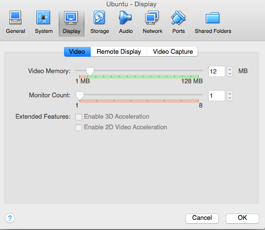
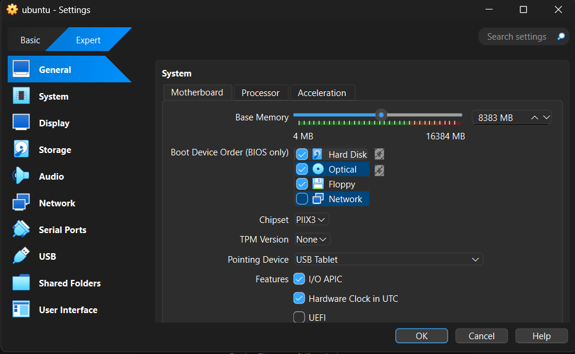
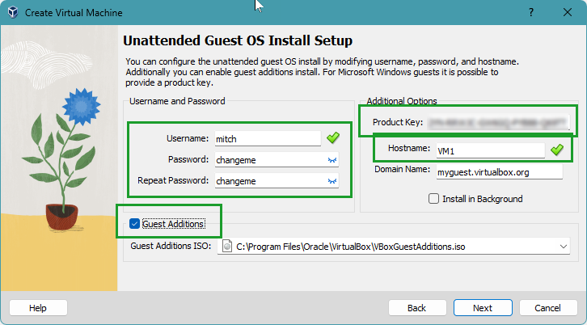
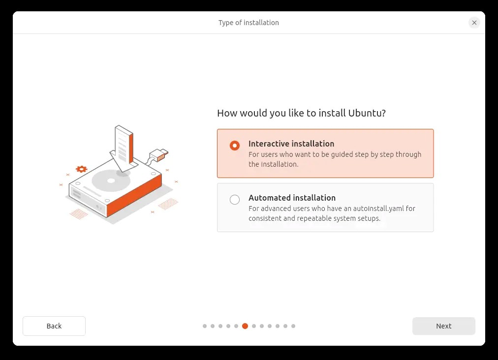
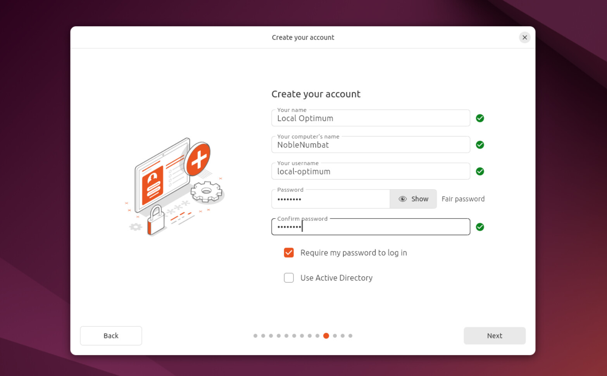

# 🖥️ **LAB 1: Installation of Linux Ubuntu on VirtualBox**

---

---

## 🐧 **What is Linux?**

> **Linux** is an **open-source operating system kernel** that powers a wide range of devices, from servers and desktops to embedded systems.  
> Developed by Linus Torvalds in 1991, Linux is renowned for its stability, security, and flexibility, making it a favorite for tech enthusiasts and professionals alike.

---

## 📝 **Step 1: Download VirtualBox**

1. 🌐 Go to the [VirtualBox Website](https://www.virtualbox.org/)
2. 💻 Select your operating system and download the installer

---

## 🛠️ **Step 2: Installing VirtualBox**

### 1️⃣ **Start the Installer**

---

### 2️⃣ **Select Installation Location**

---

### 3️⃣ **Ready to Install**

---

### 4️⃣ **Installation Complete**

---

### 5️⃣ **Open VirtualBox**

---

## 🐧 **Step 3: Installing Linux Using VirtualBox**

### 1️⃣ **Create a New Virtual Machine**

- Click **New**
- Enter a name (e.g., `Ubuntu 24.04 LTS`)
- **Type:** Linux
- **Version:** Ubuntu (64-bit)

---

### 2️⃣ **Select RAM Amount**

---

### 3️⃣ **Configure Hard Disk**

- Choose **Create a virtual hard drive now**
- Select the desired hard drive size

---

### 4️⃣ **Launch and Attach ISO**

- Click **Start**
- Select your downloaded Linux ISO file

---

### 5️⃣ **Install Ubuntu**

- Click **Install Ubuntu** (or your chosen distro)

---

### 👤 **Create Your User Account**

- Enter your details as prompted

---

## ❓ **Q&A**

💡 <strong>What are two advantages of installing Ubuntu in VirtualBox?</strong>

- 🟢 **Snapshots & Cloning:** Easily save and restore system states.
- 🟢 **Safe Experimentation:** Try new things without risking your main OS.

💡 <strong>What are two advantages of dual booting instead of using a VM?</strong>

- 🚀 **Performance:** Native speed and hardware access.
- 🖥️ **Full Compatibility:** Use all your system’s resources.

---

## 🎉 **Congratulations!**

You have successfully installed **Ubuntu Linux** on VirtualBox!  
Happy exploring! 🚀🐧

