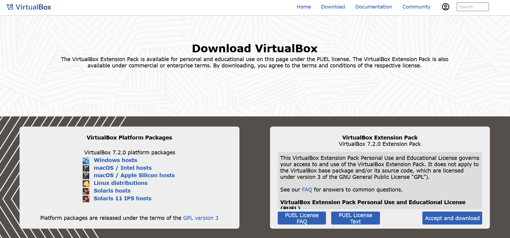
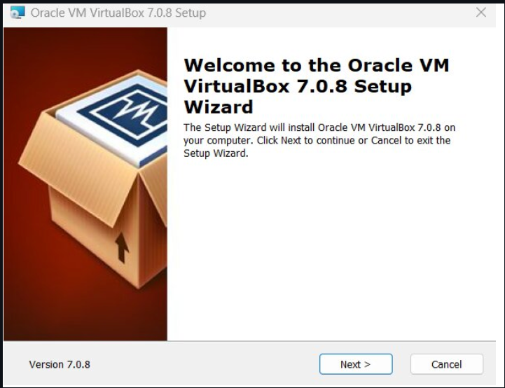
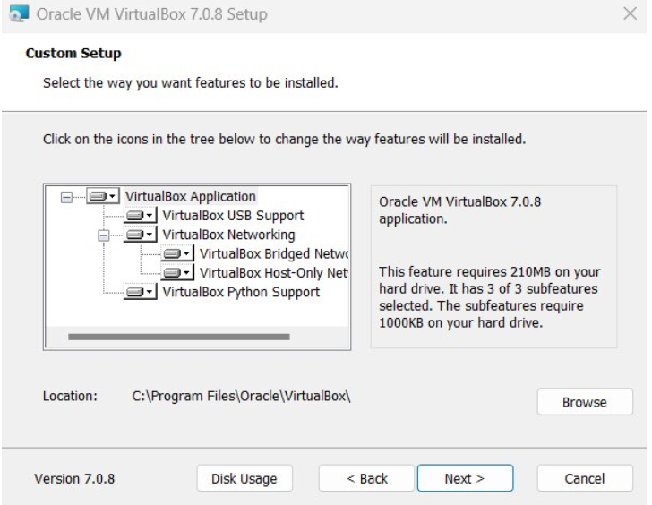
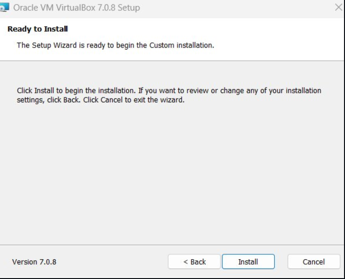
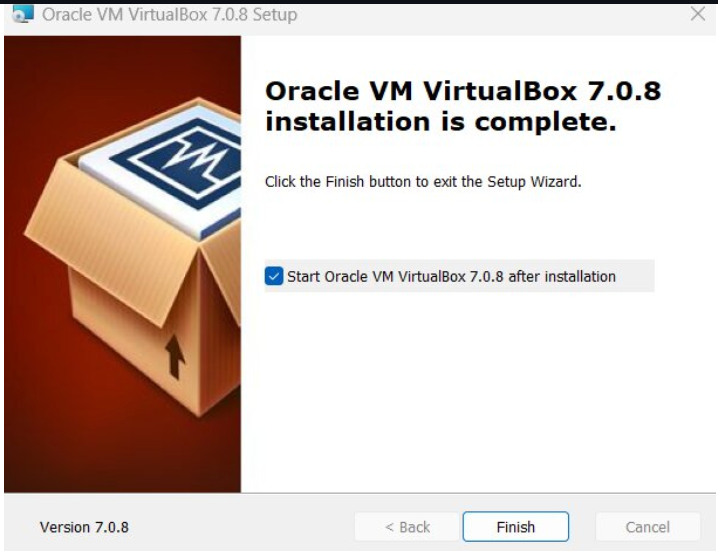
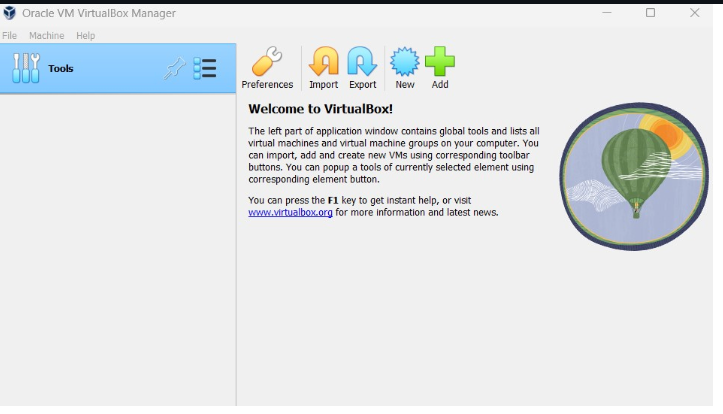

# 🖥️ LAB 1: Installation of Linux Ubuntu on VirtualBox

---

## 🐧 What is Linux?

Linux is an **open-source operating system kernel** that serves as the foundation for various operating systems, commonly referred to as **Linux distributions (distros)**. Developed by Linus Torvalds in 1991, Linux is known for its stability, security, and versatility, making it popular for servers, desktops, embedded systems, and more.

---

## 📝 Step 1: Download VirtualBox

1. Go to the [VirtualBox Website](https://www.virtualbox.org/)
2. Select your operating system

---

## 🛠️ Step 2: Installing VirtualBox

### 1️⃣ The Beginning

### 2️⃣ Select Installation Location

### 3️⃣ Ready to Install

### 4️⃣ Installation Complete

### 5️⃣ Opening VirtualBox

---

## 🐧 Step 3: Installing Linux Using VirtualBox

### 1️⃣ Naming Your Virtual Machine

After installing VirtualBox, click **New**.

- Enter a name for your system (e.g., Ubuntu 24.04 LTS)
- Select **Type:** Linux
- **Operating System:** Ubuntu (64-bit)
- **Version:** Ubuntu

---

### 2️⃣ Select the Amount of RAM

 <!-- Replace with correct image if available -->

---

### 3️⃣ Hard Disk Setting

- Choose **Create a virtual hard drive now** to make a virtual disk space.
- Select the amount of hard drive size.
- Now you are done with hardware settings.

 <!-- Replace with correct image if available -->

---

### 4️⃣ Launching Your System

- Choose the downloaded Linux ISO file.
- Click **Start** to launch your system.

.

![Install Linux](../images

---

### 👤 Make Your Account

- Enter your details as shown below.

![Account Setup](.

---

## ❓ Q&A

### 💡 What are two advantages of installing Ubuntu in VirtualBox?
- 🟢 Robust snapshot and cloning capabilities
- 🟢 Easy to experiment without affecting your main OS

### 💡 What are two advantages of dual booting instead of using a VM?
- 🚀 Better performance
- 🖥️ Full hardware compatibility and access

---

## 🎉 Congratulations!

You have successfully installed **Ubuntu Linux** on VirtualBox!