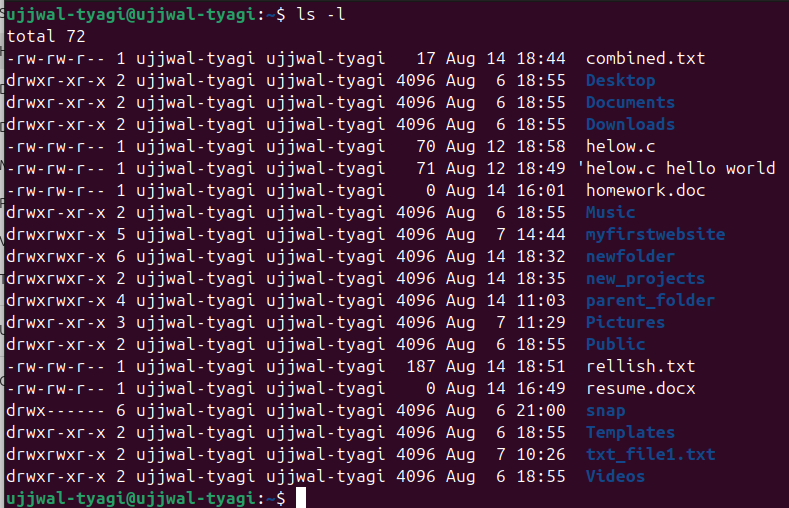
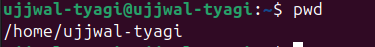
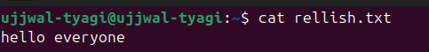
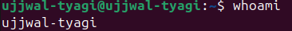

# 📝 **Assignment 1 – Unit-1: Linux Basics**

---

## 🎯 **Objective**
> Practice essential Linux commands by re-running lab files from Unit-1 and documenting commands, outputs, and explanations.

---

## 🚦 **Tasks Overview**
- Navigate to the Unit-1 folder
- Run and document commands from Lab3 and Lab5
- Answer extra questions
- Complete the checklist

---

## 📂 **Step 1: Go to Unit-1 Folder**

```bash
cd Unit-1
```
> ℹ️ **`cd`** changes your current directory. Here, you enter the **Unit-1/** folder containing lab files.

---

## 🧪 **Step 2: Commands from Lab3**

### 🔹 **Command 1: List Files (Long Format)**

```bash
ls -l
```



> 📝 **Explanation:**  
> `ls -l` lists files and directories in long format, showing permissions, owner, group, size, and modification date.

---

### 🔹 **Command 2: Show Current Directory**

```bash
pwd
```


> 📝 **Explanation:**  
> `pwd` prints the current working directory, confirming your location in the filesystem.

---

## 🧪 **Step 3: Commands from Lab5**

### 🔹 **Command 1: View File Contents**

```bash
cat rellish.txt
```



> 📝 **Explanation:**  
> `cat` displays the contents of a file directly in the terminal.

---

### 🔹 **Command 2: Show Current User**

```bash
whoami
```



> 📝 **Explanation:**  
> `whoami` prints the username of the current user.

---

## ❓ **Extra Questions**

### 1️⃣ What is the difference between `chmod` and `chown`?
- 🔑 **`chmod`**: Changes file **permissions** (read, write, execute).
- 👤 **`chown`**: Changes file **ownership** (user or group).

---

### 2️⃣ How do you check current directory and user?
- 📂 **Current directory:** `pwd`
- 👤 **Current user:** `ujjwal-tyagi`

---

<div align="center">

✨ **End of Assignment 1 – Linux Basics** ✨

</div>