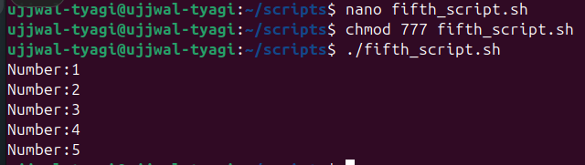
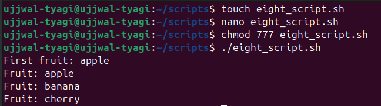

# 📝 **Assignment 2 – Script Execution & Explanation**

---

## 🎯 **Objective**
> Understand how existing scripts in the repository work by running and explaining them.

---

## 🗂️ **Script 1: `print_numbers.sh`**

### 📄 **Purpose**
Prints numbers from 1 to 5 in the terminal.

---

### 🧩 **Script Content**
```bash
#!/bin/bash
for i in {1..5}
do
  echo "Number:$i"
done
```

---

### 📝 **Line-by-Line Explanation**
1. `#!/bin/bash`  
   > Declares the script should run using the Bash shell.
2. `for i in {1..5}`  
   > Loops through numbers 1 to 5, assigning each to variable `i`.
3. `do`  
   > Begins the loop block.
4. `echo $i`  
   > Prints the current value of `i`.
5. `done`  
   > Ends the loop.

---

### ▶️ **Example Run**

```bash
$ bash fifth_script.sh
Number:1
Number:2
Number:3
Number:4
Number:5
```



---

## 🗂️ **Script 2: `eight_script.sh`**

### 📄 **Purpose**
Prints each element of an array.

---

### 🧩 **Script Content**
```bash
#!/bin/bash
arr=("apple" "banana" "cherry")
for item in "${arr[@]}"
do
  echo $item
done
```

---

### 📝 **Line-by-Line Explanation**
1. `#!/bin/bash`  
   > Declares the script should run using the Bash shell.
2. `arr=("apple" "banana" "cherry")`  
   > Defines an array with three elements.
3. `for item in "${arr[@]}"`  
   > Loops through each element in the array, assigning it to `item`.
4. `do`  
   > Begins the loop block.
5. `echo $item`  
   > Prints the current array element.
6. `done`  
   > Ends the loop.

---

### ▶️ **Example Run**

```bash
$ bash eight_script.sh
apple
banana
cherry
```



---

## ❓ **Extra Questions**

### 1️⃣ What is the purpose of `#!/bin/bash` at the top of a script?
> It tells the system to use the Bash shell to interpret the script, ensuring compatibility and correct execution.

---

### 2️⃣ How do you make a script executable?
> Use the command:
> ```bash
> chmod +x scriptname.sh
> ```
> This adds execute permissions, allowing you to run the script with `./scriptname.sh`.

---

<div align="center">

✨ **End of Assignment 2 – Script Execution & Explanation**