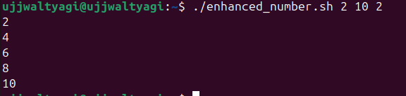
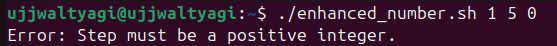

# 📝 **Assignment 3 – Modify an Existing Script**

---

## 🎯 **Objective**
> Enhance and customize a script by adding user input and validation.

---

## 🚦 **Tasks Overview**
- Select a script from `Scripts/` (e.g., `print_numbers.sh`)
- Modify it so the user provides start, end, and step values as input
- Validate inputs (e.g., step must be positive)
- Save as `enhanced_numbers.sh`
- Explain original vs. new behavior and show example runs

---

## 🗂️ **Original Script: `print_numbers.sh`**

### 📄 **Purpose**
Prints numbers from 1 to 5.

---

### 🧩 **Original Script Content**
```bash
#!/bin/bash
for i in {1..5}
do
  echo $i
done
```

---

### 📝 **Line-by-Line Explanation**
1. `#!/bin/bash`  
   > Specifies the script should run with the Bash shell.
2. `for i in {1..5}`  
   > Loops through numbers 1 to 5.
3. `do ... done`  
   > Marks the start and end of the loop block.
4. `echo $i`  
   > Prints the current number.

---

## 🛠️ **Enhanced Script: `enhanced_numbers.sh`**

### 📄 **New Features**
- User provides **start**, **end**, and **step** values as command-line arguments.
- Script validates that **step** is positive and all inputs are integers.

---

### 🧩 **Enhanced Script Content**
```bash
#!/bin/bash
# Usage: ./enhanced_numbers.sh <start> <end> <step>

if [ $# -ne 3 ]; then
  echo "Usage: $0 <start> <end> <step>"
  exit 1
fi

start=$1
end=$2
step=$3

# Validate that step is positive
if ! [[ $step =~ ^[1-9][0-9]*$ ]]; then
  echo "Error: Step must be a positive integer."
  exit 1
fi

# Validate that start and end are integers
if ! [[ $start =~ ^-?[0-9]+$ && $end =~ ^-?[0-9]+$ ]]; then
  echo "Error: Start and end must be integers."
  exit 1
fi

for ((i=start; i<=end; i+=step)); do
  echo $i
done
```

---

### 📝 **Line-by-Line Explanation**
1. `if [ $# -ne 3 ]; then ... fi`  
   > Checks if exactly 3 arguments are provided; if not, prints usage and exits.
2. `start=$1`, `end=$2`, `step=$3`  
   > Assigns command-line arguments to variables.
3. `if ! [[ $step =~ ^[1-9][0-9]*$ ]]; then ... fi`  
   > Validates that step is a positive integer.
4. `if ! [[ $start =~ ^-?[0-9]+$ && $end =~ ^-?[0-9]+$ ]]; then ... fi`  
   > Validates that start and end are integers.
5. `for ((i=start; i<=end; i+=step)); do ... done`  
   > Loops from start to end, incrementing by step, and prints each number.

---

## 🔄 **Original vs. Enhanced Behavior**

| Feature                | Original (`print_numbers.sh`) | Enhanced (`enhanced_numbers.sh`)         |
|------------------------|-------------------------------|------------------------------------------|
| Range                  | Fixed (1 to 5)                | User-defined (start, end, step)          |
| Input                  | None                          | Command-line arguments                   |
| Validation             | None                          | Checks for valid integers and step > 0   |
| Flexibility            | Low                           | High                                     |

---

## ▶️ **Example Runs**

### **Example 1:**
```bash
$ bash enhanced_numbers.sh 2 10 2
2
4
6
8
10
```


---

### **Example 2 (Invalid Step):**
```bash
$ bash enhanced_numbers.sh 1 5 0
Error: Step must be a positive integer.
```


---

## ❓ **Extra Questions**

### 1️⃣ What is the difference between `$1`, `$@`, and `$#` in bash?
- **`$1`**: The first command-line argument to the script.
- **`$@`**: All command-line arguments as separate words.
- **`$#`**: The number of command-line arguments.

---

### 2️⃣ What does `exit 1` mean in a script?
> `exit 1` ends the script with a status code of 1, indicating an error occurred.

---

<div align="center">

✨ **End of Assignment 3 – Script Enhancement & Explanation**