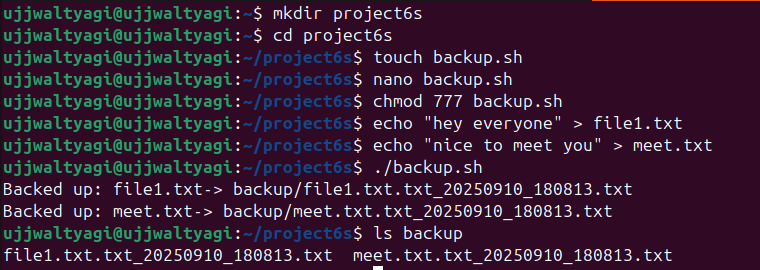

# 📝 **Assignment 4 – File & Backup Automation**

---

## 🎯 **Objective**
> Automate file management by backing up `.txt` files with timestamps.

---

## 🚦 **Tasks Overview**
- Write a script `backup.sh` that:
  - Finds all `.txt` files in the current folder
  - Copies them into `backup/` with a timestamp in the filename
- Test the script by creating some `.txt` files
- Document how the script works and show an example run

---

## 🛠️ **Script: `backup.sh`**

### 🧩 **Script Content**
```bash
#!/bin/bash
# backup.sh

mkdir -p backup

timestamp=$(date +"%Y%m%d_%H%M%S")

for file in *.txt; do
  if [ -f "$file" ]; then
    cp "$file" "backup/${file%.txt}_$timestamp.txt"
  fi
done

echo "Backup complete! All .txt files copied to backup/ with timestamp."
```

---

## 📝 **How the Script Works**
1. **Creates a backup folder** if it doesn't exist using `mkdir -p backup`.
2. **Gets the current timestamp** in `YYYYMMDD_HHMMSS` format.
3. **Loops through all `.txt` files** in the current directory.
4. **Copies each file** to the `backup/` folder, appending the timestamp to the filename.
5. **Prints a completion message** after copying.

---

## ▶️ **Example Run**

```bash
$ touch file1.txt meet.txt
$ bash backup.sh
Backup complete! All .txt files copied to backup/ with timestamp.
$ ls backup/
file1_20250910_180000.txt  meet_20250910_180000.txt
```


---

## ❓ **Extra Questions**

### 1️⃣ What is the difference between `cp`, `mv`, and `rsync`?
- **`cp`**: Copies files or directories.
- **`mv`**: Moves or renames files or directories.
- **`rsync`**: Efficiently syncs files/directories, supports incremental copy and remote transfers.

---

### 2️⃣ How can you schedule scripts to run automatically?
> Use `cron` jobs (Linux) to schedule scripts.  
> Example:  
> ```bash
> crontab -e
> ```
> Then add a line like:  
> ```
> 0 2 * * * /path/to/backup.sh
> ```
> This runs the script every day at 2:00 AM.

---

<div align="center">

✨ **End of Assignment 4 – File & Backup Automation**