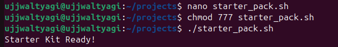
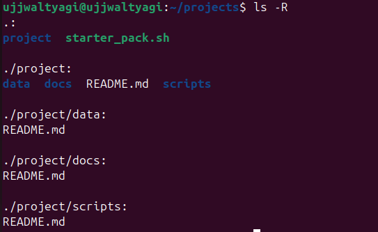

# 🚀 **Lab 5 – Starter Kit & Automation**

---

## 🎯 **Objective**
> Build a starter project environment automatically with a shell script.

---

## 🛠️ **Script: `starter_kit.sh`**

### 🧩 **Script Content**
```bash
#!/bin/bash
# starter_kit.sh

# Create project structure
mkdir -p project/scripts
mkdir -p project/docs
mkdir -p project/data

# Add placeholder README.md in each folder
echo "# Scripts" > project/scripts/README.md
echo "# Documentation" > project/docs/README.md
echo "# Data" > project/data/README.md
echo "# Project Root" > project/README.md

echo "Starter Kit Ready!"
```

---

## 📝 **How the Script Works**
1. **Creates the folder structure:**  
   - `project/`
     - `scripts/`
     - `docs/`
     - `data/`
2. **Adds a `README.md` file** in each folder with a placeholder title.
3. **Prints a completion message:**  
   - `"Starter Kit Ready!"` confirms everything is set up.


---

## ▶️ **Example Run**

```bash
$ bash starter_kit.sh
Starter Kit Ready!
$ tree project/
project/
├── README.md
├── data
│   └── README.md
├── docs
│   └── README.md
└── scripts
    └── README.md
```



---

## ❓ **Extra Questions**

### 1️⃣ What does `mkdir -p` do?
- It creates a directory and any necessary parent directories.
- If the directory already exists, it does **not** throw an error.

---

### 2️⃣ Why is automation useful in DevOps?
- **Saves time:** Repetitive tasks are handled quickly and consistently.
- **Reduces errors:** Scripts ensure the same steps are followed every time.
- **Scalability:** Makes it easy to set up environments for many projects or teams.
- **Reliability:** Automated setups are predictable and reproducible.

---

<div align="center">

✨ **End of Lab 5 – Starter Kit & Automation** ✨