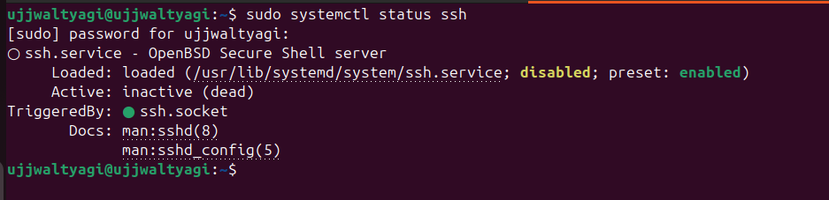

<h1 style="background: linear-gradient(90deg,#0f172a,#004aad); color:#fff; padding:18px 24px; border-radius:12px; box-shadow:0 6px 18px rgba(0,0,0,0.25); display:inline-block;">
🚀 Assignment 8 — Secure GUI Access via SSH (X11) or VNC
</h1>

<h2 style="margin-top:18px; color:#0b5cff; border-left:6px solid #ffd54f; padding-left:12px;">
🧪 <strong>Experiment:</strong> Basic Linux Data Networking Commands
</h2>

<h3 style="color:#0f5132; background:#e6fff4; padding:10px 12px; border-radius:8px;">
🎯 <strong>Aim</strong>
</h3>

To study and execute basic data networking commands in Linux using the command line interface.

<h3 style="color:#0b3a75; background:#eef6ff; padding:10px 12px; border-radius:8px;">
📌 <strong>Objectives</strong>
</h3>
<ul>
<li>To understand Linux network configuration.</li>
<li>To test network connectivity.</li>
<li>To diagnose network-related issues.</li>
<li>To access and transfer data between systems using networking tools.</li>
</ul>

<h3 style="color:#7b3b00; background:#fff6e6; padding:10px 12px; border-radius:8px;">
🧾 <strong>Requirements</strong>
</h3>
<ul>
<li>Linux Operating System (Ubuntu/Debian/Fedora/Kali etc.)</li>
<li>Terminal access</li>
<li>Basic knowledge of Linux commands</li>
<li>Internet connection (optional)</li>
</ul>

<h3 style="color:#004d40; background:#e6fff5; padding:10px 12px; border-radius:8px;">
📚 <strong>Theory</strong>
</h3>

Data networking in Linux is performed using built-in terminal commands. These commands help configure systems, test connections, and troubleshoot network problems.

<table style="width:100%; border-collapse:collapse; margin-top:8px;">
<tr style="background:#0b69ff; color:#fff;">
<th style="padding:8px; text-align:left;">Command</th>
<th style="padding:8px; text-align:left;">Purpose</th>
</tr>
<tr style="background:#f7f9ff;">
<td style="padding:8px;"><code>ifconfig</code> / <code>ip addr</code></td>
<td style="padding:8px;">Shows network interface configuration</td>
</tr>
<tr>
<td style="padding:8px;"><code>ping</code></td>
<td style="padding:8px;">Tests connectivity to another host</td>
</tr>
<tr style="background:#f7f9ff;">
<td style="padding:8px;"><code>hostname</code></td>
<td style="padding:8px;">Displays system hostname</td>
</tr>
<tr>
<td style="padding:8px;"><code>traceroute</code></td>
<td style="padding:8px;">Shows the route packets take</td>
</tr>
<tr style="background:#f7f9ff;">
<td style="padding:8px;"><code>netstat</code></td>
<td style="padding:8px;">Displays active connections</td>
</tr>
<tr>
<td style="padding:8px;"><code>nslookup</code></td>
<td style="padding:8px;">Queries DNS information</td>
</tr>
<tr style="background:#f7f9ff;">
<td style="padding:8px;"><code>ssh</code></td>
<td style="padding:8px;">Secure remote login</td>
</tr>
<tr>
<td style="padding:8px;"><code>scp</code></td>
<td style="padding:8px;">Secure file transfer</td>
</tr>
</table>

<h2 style="color:#0b5cff; background:linear-gradient(90deg,#f0f8ff,#e6f0ff); padding:12px 14px; border-radius:10px;">
🏠 <strong>Case 1 — Same Network (LAN): Friend's Ubuntu ↔ Your Ubuntu</strong>
</h2>

<h3 style="color:#006064; background:#e6fffb; padding:8px 10px; border-radius:8px;">
✅ Step 1: Enable SSH on Ubuntu
</h3>
<pre style="background:#0d1b2a; color:#e6f7ff; padding:12px; border-radius:8px; overflow:auto;">
sudo apt update
sudo apt install openssh-server
sudo systemctl enable ssh
sudo systemctl start ssh
</pre>

<h3 style="color:#006064; background:#e6fffb; padding:8px 10px; border-radius:8px;">
✅ Step 2: Find Ubuntu's local IP address
</h3>
<pre style="background:#0d1b2a; color:#e6f7ff; padding:12px; border-radius:8px; overflow:auto;">
hostname -I
</pre>

<h3 style="color:#006064; background:#e6fffb; padding:8px 10px; border-radius:8px;">
✅ Step 3: Connect from friend's Ubuntu
</h3>
<pre style="background:#0d1b2a; color:#e6f7ff; padding:12px; border-radius:8px; overflow:auto;">
ssh username@192.168.1.42
</pre>

<h3 style="color:#006064; background:#e6fffb; padding:8px 10px; border-radius:8px;">
✅ Step 4–7: Create, verify, delete file & exit
</h3>
<pre style="background:#0d1b2a; color:#e6f7ff; padding:12px; border-radius:8px; overflow:auto;">
echo "This file was created remotely using SSH" > ~/ssh_test.txt
cat ~/ssh_test.txt
rm ~/ssh_test.txt
exit
</pre>

<h2 style="color:#7b3b00; background:linear-gradient(90deg,#fff7e6,#fff2d9); padding:12px 14px; border-radius:10px;">
🌐 <strong>Case 2 — Different Networks (WAN): Remote Server / Cloud VM</strong>
</h2>

<h3 style="color:#0b3a75; background:#eef6ff; padding:8px 10px; border-radius:8px;">
🔹 Step 1: View IP Address & Interfaces
</h3>
<pre style="background:#0d1b2a; color:#e6f7ff; padding:12px; border-radius:8px; overflow:auto;">
ip addr show
</pre>

<h3 style="color:#0b3a75; background:#eef6ff; padding:8px 10px; border-radius:8px;">
🔹 Step 2: Display hostname
</h3>
<pre style="background:#0d1b2a; color:#e6f7ff; padding:12px; border-radius:8px; overflow:auto;">
hostname
</pre>

<h3 style="color:#0b3a75; background:#eef6ff; padding:8px 10px; border-radius:8px;">
🔹 Step 3–6: Connectivity tests & diagnostics
</h3>
<pre style="background:#0d1b2a; color:#e6f7ff; padding:12px; border-radius:8px; overflow:auto;">
ping google.com -c 4
traceroute google.com
netstat -tulnp
nslookup google.com
</pre>

<h3 style="color:#0b3a75; background:#eef6ff; padding:8px 10px; border-radius:8px;">
🔹 Step 7–8: Remote login & SCP transfer
</h3>
<pre style="background:#0d1b2a; color:#e6f7ff; padding:12px; border-radius:8px; overflow:auto;">
ssh user@192.168.1.10
scp test.txt user@192.168.1.10:/home/user/
</pre>

<h2 style="color:#0b5cff; background:linear-gradient(90deg,#f0f8ff,#e6f0ff); padding:12px 14px; border-radius:10px;">
🏠 <strong>GUI — Secure Remote Desktop & X11</strong>
</h2>

<h3 style="color:#006064; background:#e6fffb; padding:8px 10px; border-radius:8px;">
✅ 1) Prepare & secure the remote machine (friend's laptop)
</h3>
<pre style="background:#0d1b2a; color:#e6f7ff; padding:12px; border-radius:8px; overflow:auto;">
sudo apt update
sudo apt install -y openssh-server tigervnc-standalone-server
sudo useradd -m frienduser || true
sudo systemctl enable --now ssh
sudo -u frienduser mkdir -p /home/frienduser/.ssh
echo "<your-pubkey>" | sudo tee -a /home/frienduser/.ssh/authorized_keys
sudo chmod 700 /home/frienduser/.ssh
sudo chmod 600 /home/frienduser/.ssh/authorized_keys
sudo chown -R frienduser:frienduser /home/frienduser/.ssh
sudo systemctl status ssh --no-pager
ss -tlnp | grep :22
</pre>

<h3 style="color:#006064; background:#e6fffb; padding:8px 10px; border-radius:8px;">
✅ 2) Test X11 forwarding (single GUI app) — from your laptop
</h3>

Preflight: ensure local X server (Linux desktop, XQuartz on macOS, or VcXsrv/Xming on Windows) is running.

<pre style="background:#0d1b2a; color:#e6f7ff; padding:12px; border-radius:8px; overflow:auto;">
ssh -p 22 -X frienduser@FRIEND_IP
# on remote after login:
xeyes &    # or gedit & or xclock &
</pre>

<strong>Success criteria:</strong> GUI app window appears on your laptop and is responsive.

<h3 style="color:#006064; background:#e6fffb; padding:8px 10px; border-radius:8px;">
✅ 3) Full desktop: VNC server on friend’s laptop + SSH tunnel from your laptop
</h3>
<pre style="background:#0d1b2a; color:#e6f7ff; padding:12px; border-radius:8px; overflow:auto;">
# on friend (as frienduser)
vncserver :1

# on your laptop (create tunnel)
ssh -L 5901:localhost:5901 -p 22 frienduser@FRIEND_IP -N &

# open VNC client to:
localhost:5901
</pre>

<h2 style="color:#0b3a75; background:#eef6ff; padding:12px 14px; border-radius:10px;">
📈 <strong>Output / Observations</strong>
</h2>
<table style="width:100%; border-collapse:collapse; margin-top:8px;">
<tr style="background:#0b69ff; color:#fff;">
<th style="padding:8px; text-align:left;">Command</th>
<th style="padding:8px; text-align:left;">Result</th>
</tr>
<tr style="background:#f7f9ff;">
<td style="padding:8px;"><code>ip addr</code></td>
<td style="padding:8px;">Lists network interfaces and IP addresses</td>
</tr>
<tr>
<td style="padding:8px;"><code>ping</code></td>
<td style="padding:8px;">Replies received indicate connectivity</td>
</tr>
<tr style="background:#f7f9ff;">
<td style="padding:8px;"><code>traceroute</code></td>
<td style="padding:8px;">Displays the route path to the destination</td>
</tr>
<tr>
<td style="padding:8px;"><code>nslookup</code></td>
<td style="padding:8px;">Shows DNS IP information</td>
</tr>
<tr style="background:#f7f9ff;">
<td style="padding:8px;"><code>ssh</code></td>
<td style="padding:8px;">Connects to a remote machine securely</td>
</tr>
<tr>
<td style="padding:8px;"><code>scp</code></td>
<td style="padding:8px;">Transfers files securely over SSH</td>
</tr>
</table>

<h2 style="color:#0b5cff; background:linear-gradient(90deg,#f0f8ff,#e6f0ff); padding:12px 14px; border-radius:10px;">
✅ <strong>Result & Conclusion</strong>
</h2>

Basic Linux networking commands were successfully executed and network connectivity and configuration were verified. SSH and VNC procedures were demonstrated for both LAN and WAN scenarios.

<h2 style="color:#7b3b00; background:linear-gradient(90deg,#fff7e6,#fff2d9); padding:12px 14px; border-radius:10px;">
❓ <strong>Viva Questions (Quick)</strong>
</h2>

<h4 style="color:#0b3a75;">What is the purpose of the <code>ping</code> command?</h4>

The <code>ping</code> command is used to test network connectivity by sending ICMP Echo Request packets and measuring replies and round-trip time.

<h4 style="color:#0b3a75;">What is the difference between SSH and Telnet?</h4>
<table style="width:100%; border-collapse:collapse; margin-top:8px;">
<tr style="background:#0b69ff; color:#fff;">
<th style="padding:8px;">Feature</th><th style="padding:8px;">SSH (Secure Shell)</th><th style="padding:8px;">Telnet</th>
</tr>
<tr style="background:#f7f9ff;">
<td style="padding:8px;">Security</td><td style="padding:8px;">Encrypted communication</td><td style="padding:8px;">No encryption</td>
</tr>
<tr>
<td style="padding:8px;">Default Port</td><td style="padding:8px;">22</td><td style="padding:8px;">23</td>
</tr>
<tr style="background:#f7f9ff;">
<td style="padding:8px;">Usage</td><td style="padding:8px;">Secure remote login</td><td style="padding:8px;">Unsecure remote login</td>
</tr>
</table>

<h4 style="color:#0b3a75;">How does <code>traceroute</code> help?</h4>

<code>traceroute</code> shows each hop between source and destination and helps identify delays and routing issues.

<h4 style="color:#0b3a75;">Why is DNS used?</h4>

DNS maps human-friendly hostnames to IP addresses so machines can route network packets correctly.

<h4 style="color:#0b3a75;">How to transfer files securely in Linux?</h4>

Use <code>scp</code> which leverages SSH encryption:

<pre style="background:#0d1b2a; color:#e6f7ff; padding:12px; border-radius:8px; overflow:auto;">
scp file.txt user@192.168.1.10:/home/user/
</pre>

Made with ❤ — concise, colorful, and image-preserving overview of Linux Networking & SSH.

