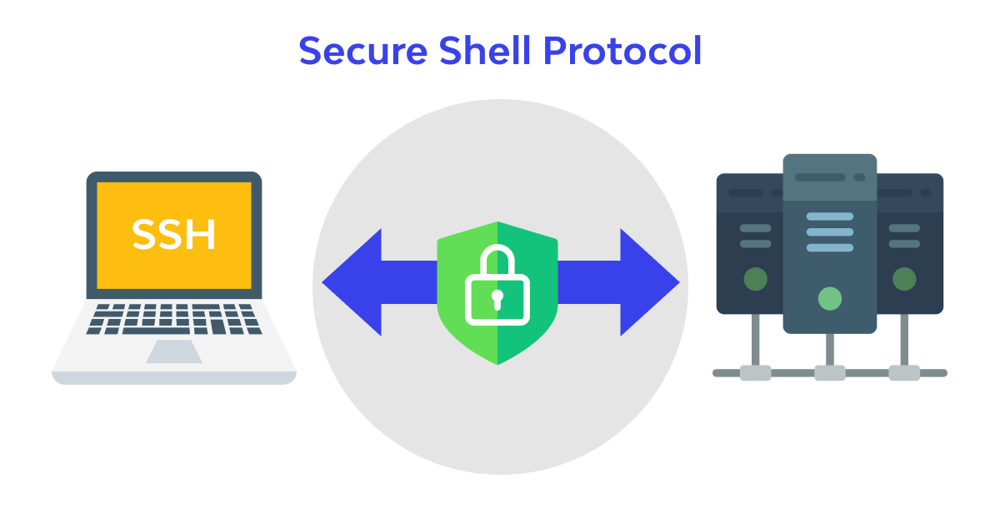

# 🚀 Assignment 8 — Secure GUI Access via SSH (X11) or VNC

<div align="center">



# **Experiment: Basic Linux Data Networking Commands**

## **Aim**
To study and execute basic data networking commands in Linux using the command line interface.

---

## **Objectives**
- To understand Linux network configuration.
- To test network connectivity.
- To diagnose network-related issues.
- To access and transfer data between systems using networking tools.

---

## **Requirements**
- Linux Operating System (Ubuntu/Debian/Fedora/Kali etc.)
- Terminal access
- Basic knowledge of Linux commands
- Internet connection (optional)

---

## **Theory**
Data networking in Linux is performed using built-in terminal commands. These commands help configure systems, test connections, and troubleshoot network problems.

| Command | Purpose |
|----------|---------|
| `ifconfig` / `ip addr` | Shows network interface configuration |
| `ping` | Tests connectivity to another host |
| `hostname` | Displays system hostname |
| `traceroute` | Shows the route packets take |
| `netstat` | Displays active connections |
| `nslookup` | Queries DNS information |
| `ssh` | Secure remote login |
| `scp` | Secure file transfer |

---

## **Procedure**

# **🏠 Case 1: Friend's ubuntu and Ubuntu on the same network**
## **✅Step 1: Enable SSH on Ubuntu**

On Ubuntu, install and enable SSH:
```
sudo apt update
sudo apt install openssh-server
sudo systemctl enable ssh
sudo systemctl start ssh
```

Check it’s running:

```
sudo systemctl status ssh
```

##  ✅ Step 2: Find Ubuntu’s local IP address

Run:

```
hostname -I
```

You’ll get something like 192.168.1.42.

## ✅ Step 3: Connect from friends ubuntu

On your friends ubuntu, open Terminal and run:

```
ssh username@192.168.1.42
```
Replace username with your Ubuntu username.

Enter your password when prompted — you’re in! ✅


## ✅ Step 4: Create a File on Remote Computer
```bash
echo "This file was created remotely using SSH" > ~/ssh_test.txt
```
## ✅ Step 5: Verify the File**
```bash
cat ~/ssh_test.txt
```
## ✅ Step 6: Delete the File
```bash
rm ~/ssh_test.txt
```
## ✅ Step 7: Exit SSH
```bash
exit
```


# **🌐 Case 2: Ubuntu and Ubuntu on different networks (e.g., home ↔ office or remote server)**

##  **✅🔹 Option 1: Connect to a remote Ubuntu server (e.g., cloud VM)**

### **Step 1: View IP Address and Network Interfaces**
```bash
ip addr show
```


### **Step 2:Display hostname**
```bash
hostname
```

---
### **step 3:Test Network connectivity(ping)**
```bash
ping google.com -c 4
```


### **Step 4: Trace Route to Remote Host**
```bash
traceroute google.com
```

---
### **Step 5: View Active Network Ports**
```bash
netstat -tulnp
```

---
### **Step 6: DNS Lookup**
```bash
nslookup google.com
```

---

### **Step 7: Remote Login using SSH**
```bash
ssh user@192.168.1.10
```

---
### **Step 8: File Transfer using SCP**
```bash
scp test.txt user@192.168.1.10:/home/user/
```

---
# **🏠 GUI**

# **✅1) Prepare & secure the remote machine (run on friend’s laptop)**

Run these on the friend’s laptop (they must have sudo):

# **install SSH and optional VNC**
```bash
sudo apt update
sudo apt install -y openssh-server tigervnc-standalone-server
```

---

# **create non-root user if needed (won't fail if exists)**
```bash
sudo useradd -m frienduser || true
```

---

# **enable and start SSH**
```bash
sudo systemctl enable --now ssh
```

---

# **add your public key (replace <your-pubkey>) and set safe permissions**
```bash
sudo -u frienduser mkdir -p /home/frienduser/.ssh
echo "<your-pubkey>" | sudo tee -a /home/frienduser/.ssh/authorized_keys
sudo chmod 700 /home/frienduser/.ssh
sudo chmod 600 /home/frienduser/.ssh/authorized_keys
sudo chown -R frienduser:frienduser /home/frienduser/.ssh
```


---

Verify sshd is running:
```bash
sudo systemctl status ssh --no-pager
# or
ss -tlnp | grep :22
```

---
# ✅2) Test X11 forwarding (single GUI app) — from your laptop

Preflight on your laptop:

Linux: usually ready.

macOS: install & run XQuartz and start it before SSH.

Windows: install an X server like VcXsrv or Xming and run it.

Then on your laptop run:


```bash
ssh -p 22 -X frienduser@FRIEND_IP
``
# once connected, run a simple GUI test:
```bash
xeyes &    # or gedit & or xclock &
```

Success criteria: the GUI app window appears on your laptop and is responsive.

Troubleshooting quick checks:

If you see Warning: No xauth data; using fake or X apps fail: try -Y (trusted) instead of -X: ssh -Y -p 22 frienduser@FRIEND_IP.

Ensure DISPLAY is set on the SSH session (run echo $DISPLAY — should show something like localhost:10.0).

Ensure client X server (XQuartz/VcXsrv) is running and allowing connections.

Security note: X11 forwards every GUI app over SSH, but X11 is older and can let remote apps access local X resources — use only with trusted machines. For stronger isolation, prefer the VNC-over-SSH approach below.

# ✅ 3) Full desktop: VNC server on friend’s laptop + SSH tunnel from your laptop

On friend’s laptop (as frienduser):


# start a VNC server on display :1 (creates :1 -> TCP 5901)
```bash
vncserver :1
# optionally stop with: vncserver -kill :1
```
(Configure desktop environment in ~/.vnc/xstartup if needed — many distros auto-configure.)

On your laptop: create a local SSH tunnel (keeps VNC server bound to localhost on remote; only SSH port open externally)


# create an SSH tunnel mapping your localhost:5901 to friend's localhost:5901
```bash
ssh -L 5901:localhost:5901 -p 22 frienduser@FRIEND_IP -N &
# -N = no remote command; & runs in background (adjust as preferred)
```

---
Then open your VNC viewer and connect to:

```bash
localhost:5901
```

## **Output / Observations**

| Command     | Result                                      |
|-------------|---------------------------------------------|
| `ip addr`   | Lists network interfaces and IP addresses   |
| `ping`      | Replies received indicate connectivity      |
| `traceroute`| Displays the route path to the destination  |
| `nslookup`  | Shows DNS IP information                    |
| `ssh`       | Connects to a remote machine securely       |
| `scp`       | Transfers files securely over SSH           |

---

## **Result**
Basic Linux networking commands were successfully executed and network connectivity and configuration were verified.

---

## **Conclusion**
Linux provides powerful built-in commands for networking tasks such as configuration, troubleshooting, monitoring, and secure communication between systems.

---

## **Viva Questions**

### ❓ What is the purpose of the `ping` command?

### ✨The `ping` command is used to test network connectivity between the source and a destination host. It sends ICMP Echo Request packets and waits for Echo Reply packets to verify whether the destination is reachable and to measure round-trip time.

---

### ❓ What is the difference between SSH and Telnet?

### ✨| Feature | SSH (Secure Shell) | Telnet |
|----------|-------------------|--------|
| Security | Encrypted communication | No encryption |
| Default Port | 22 | 23 |
| Usage | Secure remote login | Unsecure remote login |
| Current Status | Widely used | Mostly outdated |

*SSH is preferred over Telnet because it provides secure communication.*

---

### ❓ How does `traceroute` help in network troubleshooting?

### ✨`traceroute` displays the path taken by packets from the local system to a remote host. It shows each intermediate router (hop) along the path and the time taken. It helps identify:
- Network delays
- Connection failures
- Routing issues

---

### ❓ Why is DNS used in networking?

### ✨DNS (Domain Name System) translates human-friendly domain names like `www.google.com` into machine-readable IP addresses like `142.250.182.14`. This is necessary because computers communicate using IP addresses, not domain names.

---

### ❓ How can you transfer a file securely in Linux?

### ✨Files can be transferred securely in Linux using the `scp` (Secure Copy) command, which uses SSH encryption.

Example:
```bash
scp file.txt user@192.168.1.10:/home/user/
```