# 🌐 General Overview — Linux Networking & SSH

<div align="center">

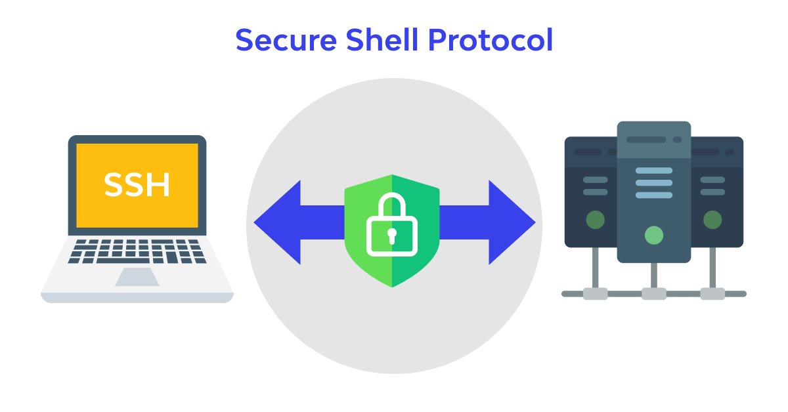

</div>

---

## 📘 Scope & Purpose
This document is a concise, practical overview of Linux networking essentials and Secure Shell (SSH). It combines foundational networking concepts, common commands, and SSH workflows (keys, agents, forwarding, file transfer, and troubleshooting). All screenshots and images already present in the file are preserved for reference and examples.

---

## 🔧 Linux Networking Essentials (quick reference)

- Network interfaces and addresses
  - View interfaces: `ip addr show` or `hostname -I`  
  

- Routing & connectivity
  - Show routing table: `ip route`
  - Test reachability: `ping <host>` / `traceroute <host>`

- DNS
  - Query DNS: `dig example.com` or `nslookup example.com`

- Firewall basics (ufw / iptables)
  - Allow SSH: `sudo ufw allow ssh`
  - Check rules: `sudo ufw status verbose`

- Common troubleshooting
  - Check links: `ip link`
  - Check active sockets: `ss -tulpn`
  - View logs: `sudo journalctl -u NetworkManager -e`

---

## 🔒 SSH — Conceptual Overview

- What is SSH?
  - Secure remote login, command execution and file transfer over an encrypted channel.
  - Default TCP port: 22.

- Key benefits
  - Confidentiality (encryption), integrity, and strong authentication (public/private keys).
  - Supports port forwarding, X11 forwarding, agent forwarding, and file transfer (SCP/SFTP).

---

## 🛠 Practical SSH: Commands & Workflows

### 1) Generate keypair (recommended ed25519)
```bash
ssh-keygen -t ed25519 -C "your_email@example.com"
```
Example (from this repo):
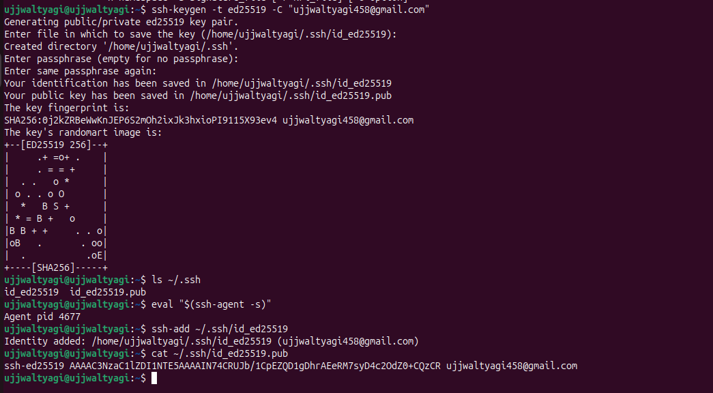

### 2) Install public key on remote
Preferred:
```bash
ssh-copy-id -i ~/.ssh/id_ed25519.pub user@remote.host
```
Manual:
```bash
cat ~/.ssh/id_ed25519.pub | ssh user@remote.host 'mkdir -p ~/.ssh && cat >> ~/.ssh/authorized_keys && chmod 600 ~/.ssh/authorized_keys'
```
Example image:
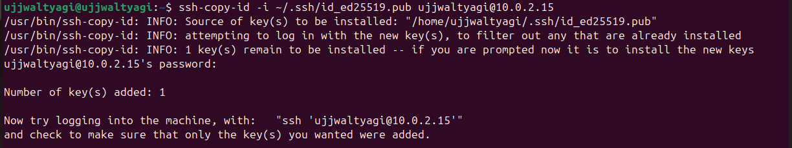

### 3) Connect & run commands
Interactive:
```bash
ssh user@192.168.1.100
```
Single command:
```bash
ssh user@192.168.1.100 'uname -a && uptime'
```
Example:
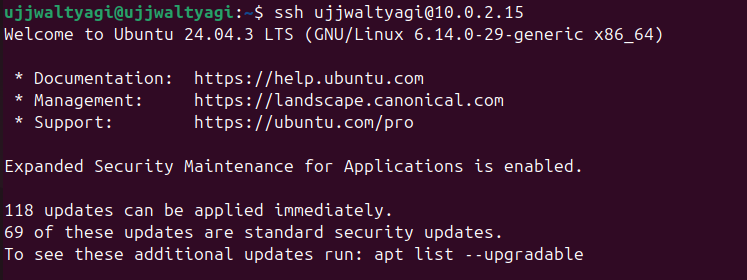

---

## 🔁 SSH Agent & Config

- Start agent and add key:
```bash
eval "$(ssh-agent -s)"
ssh-add ~/.ssh/id_ed25519
ssh-add -l
```
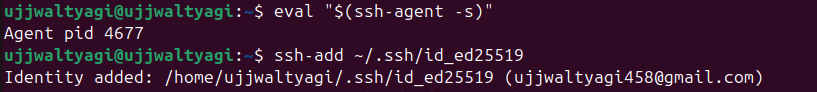

- Useful `~/.ssh/config` entry:
```text
Host local-server
  HostName 192.168.1.100
  User youruser
  IdentityFile ~/.ssh/id_ed25519
  IdentitiesOnly yes
```
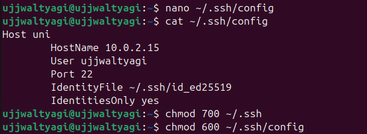

Connect with:
```bash
ssh local-server
```
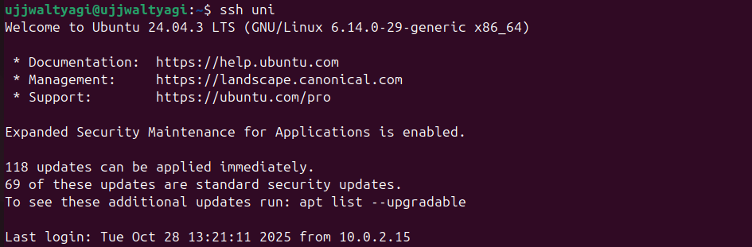

---

## 🔀 Port Forwarding & Tunneling

- Local forward (access remote web app locally):
```bash
ssh -L 8080:localhost:8000 user@192.168.1.100
# then browse http://localhost:8080
```
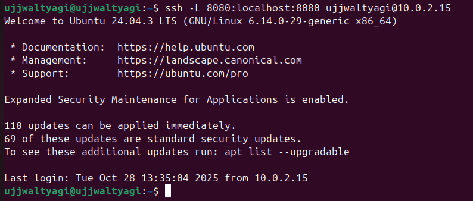

- Remote forward and dynamic SOCKS proxy (SSH as proxy):
```bash
ssh -R 9000:localhost:22 user@remote.host
ssh -D 1080 user@remote.host   # dynamic SOCKS proxy
```

---

## 📂 File Transfer (SCP / SFTP)

- Copy single file:
```bash
scp localfile.txt user@192.168.1.100:/home/user/
```
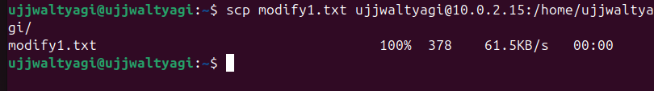

- Copy directory:
```bash
scp -r project/ user@192.168.1.100:/home/user/project_backup/
```
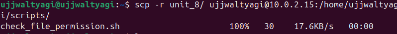
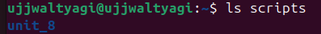

- Interactive SFTP:
```bash
sftp user@192.168.1.100
sftp> put localfile
```
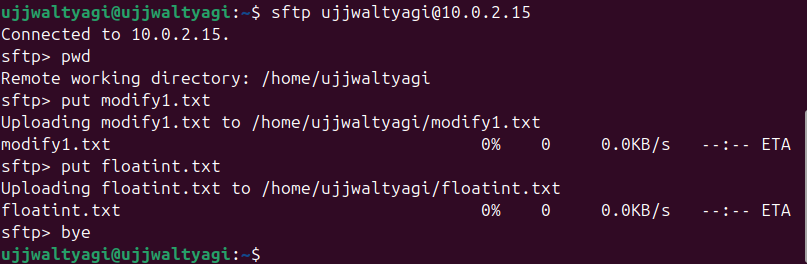

---

## 🛠 Troubleshooting & Best Practices

- Permissions: `chmod 700 ~/.ssh && chmod 600 ~/.ssh/authorized_keys`
- Debugging: `ssh -vvv user@host`
- Check server logs: `sudo journalctl -u ssh -e` or `sudo tail -n 200 /var/log/auth.log`
- Use strong keys (ed25519), protect private keys with passphrase
- Disable root login and password auth on servers for production:
  - Edit `/etc/ssh/sshd_config`:
    - `PermitRootLogin no`
    - `PasswordAuthentication no`
  - Restart: `sudo systemctl restart ssh`

---

## 📌 Quick Commands Summary
```bash
# networking
ip addr show
ip route
ss -tulpn
ping 8.8.8.8

# SSH basics
ssh-keygen -t ed25519
ssh-copy-id user@host
ssh user@host
scp file user@host:/path/
ssh -L 8080:localhost:8000 user@host
```

---

## 📎 References & Next Steps
- man pages: `man ssh`, `man sshd`, `man scp`, `man sftp`  
- Further topics to add (recommended): VPNs (WireGuard/Tailscale), SSH certificate auth, SSH jump hosts, X11 vs Wayland caveats.

---