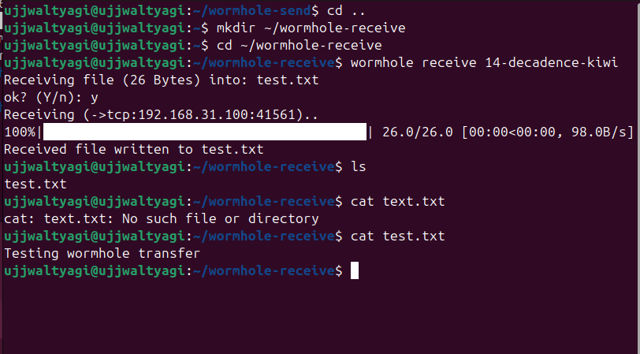
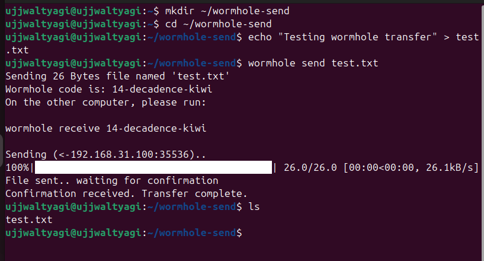

# 🌌 Magic Wormhole — Secure Cross‑Network File Transfer (Overview & Guide)

<div align="center">


**Secure, simple, encrypted file transfer across different networks — no port forwarding, no public IPs. ✨**

</div>

---

## 📚 Purpose
This document is a compact, practical overview of Magic Wormhole for transferring files between computers on different networks. It preserves all original images and examples and adds clear, professional headings, testing tips, and deliverables.

---

## 🔧 What is Magic Wormhole?
Magic Wormhole is a small CLI utility that creates a short-lived, end‑to‑end encrypted channel between two machines. Sender produces a one‑time code (e.g., 9-night-bird). Receiver uses that code to securely pull the file.

---

## ✅ Why use it?
- Works across NATs and firewalls (no port forwarding)  
- One‑time codes (simple UX)  
- End‑to‑end encryption (privacy)  
- Lightweight and scriptable

---

## ⚙️ Installation (both machines)
```bash
sudo apt update
sudo apt install -y magic-wormhole
```

---

## 📤 Sender — How to send a file
1. Change to the file directory:
```bash
cd ~
```
2. Send:
```bash
wormhole send file.sh
```
3. Note the wormhole code shown (example: `9-night-bird`) and keep the terminal open until transfer finishes.

---

## 📥 Receiver — How to receive a file
1. In your target directory run:
```bash
wormhole receive 9-night-bird
```
2. Wait for transfer; file downloads to current directory.
3. If script, make executable:
```bash
chmod +x file.sh
./file.sh
```

---

## 🧪 Test on a Single Machine (two terminals)
You can fully test the workflow locally using two terminals (simulates sender + receiver):

Terminal A (sender)
```bash
mkdir ~/worm-send && cd ~/worm-send
echo "Hello" > test.txt
wormhole send test.txt
# note the code
```

Terminal B (receiver)
```bash
mkdir ~/worm-recv && cd ~/worm-recv
wormhole receive <code-from-terminal-A>
ls
cat test.txt
```

This validates the full encrypted transfer path without needing a second physical device.

---

## 🔐 Security & Best Practices
- Use small, one-time sensitive files only as needed.  
- Verify code over a trusted channel to avoid social engineering.  
- Prefer latest release of magic-wormhole.  
- For automated workflows, use wormhole’s Python API with care and secure credentials.

---

## 📸 Example Screenshots (kept from original)
### Receiver's View


### Sender's View


---

## 🧾 Quick Reference
| Action | Command |
|:------:|:--------|
| Install | `sudo apt install magic-wormhole` |
| Send | `wormhole send file.sh` |
| Receive | `wormhole receive CODE` |
| Make executable | `chmod +x file.sh` |

---

## 🚀 Deliverables / Lab Evidence
- Screenshot of sender terminal with wormhole code (kept).  
- Screenshot of receiver terminal showing successful receipt (kept).  
- Optional: `ls` output showing received file, and `chmod` / run result.

---

## 📎 Notes & Links
- Docs: https://magic-wormhole.readthedocs.io/  
- Use `wormhole --help` for advanced flags and options.

---

<div align="center">  
Made for easy, secure file transfer — happy sharing! 💫  
</div>