<div align="center">
  <h1 style="background: linear-gradient(90deg,#001f3f,#0066cc); color:#fff; padding:20px 28px; border-radius:14px; box-shadow:0 8px 24px rgba(0,0,0,0.28); display:inline-block; font-family:system-ui, -apple-system, 'Segoe UI', Roboto, 'Helvetica Neue', Arial;">
    🐧 Linux Process Management — Lab Report
  </h1>
  <p style="color:#6b7280; margin-top:8px;">Concise lab report with commands, examples and screenshots — process states, monitoring, priorities and advanced tooling.</p>
</div>

<hr style="border:0; height:1px; background:linear-gradient(90deg,#eef2ff,#f7fbff); margin:18px 0;" />

## 🎯 Objective
> Understanding and implementing process management concepts in Linux through hands-on examples.

---

## 🔍 Theory

### 🔸 What is a Process?
A process is an instance of a running program with its own memory space and system resources.

### 🔸 Process States
- 🟢 R (Running/Runnable)
- 🟡 S (Sleeping — waiting for event)
- 🔴 D (Uninterruptible sleep)
- 🟠 T (Stopped)
- ⚫ Z (Zombie)

### 🔸 Process Types
- ⌨️ Foreground: Connected to terminal
- 🔙 Background: Runs independently

### 🔸 Process Identifiers
- 🆔 PID: Unique process ID
- 👨‍👦 PPID: Parent process ID

### 🔸 Core Concepts
- 👨‍👦 Parent/Child processes
- 🧟 Zombie processes
- 🤝 Orphan processes

---

## ⚡ Commands & Examples

### View all processes (detailed)
```bash
ps aux
```
**Explanation:** Shows all running processes with user, PID, %CPU, %MEM, VSZ, RSS, TTY, STAT, START, TIME, and COMMAND.
---

---

---
### Hierarchical process view
```bash
pstree -p
```
**Explanation:** Displays processes in a tree form with PIDs — useful to see parent/child relations.
---


---
---
---


---

### Real-time monitoring
```bash
top
```
**Explanation:** Interactive display of processes sorted by CPU usage. Press `q` to quit.

---


---
```bash
htop
```
**Explanation:** Enhanced interactive viewer with process tree, colors, and easier navigation.

---


---

### Run process in background
```bash
sleep 300 &
```
**Explanation:** Starts `sleep` in background; shell prints the job number and PID.

---


---

### List jobs in current shell
```bash
jobs -l
```
**Explanation:** Lists jobs started from the current shell with job IDs and PIDs.

---

---

### Bring job to foreground / send to background
```bash
fg %1
bg %1
```
**Explanation:** `fg` brings job 1 to foreground; `bg` resumes job 1 in background.


---

### Disown a background job
```bash
disown %1
```
**Explanation:** Removes job 1 from shell's job table so it will not receive SIGHUP on shell exit.

---
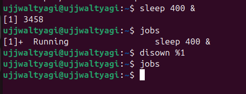
---

### Run detached (nohup)
```bash
nohup python3 server.py > server.log 2>&1 &
```
**Explanation:** Starts `server.py` immune to hangups; output redirected to `server.log`.

---

---

### Find process by name / PID
```bash
pgrep -a sshd
pidof bash
```
**Explanation:** `pgrep -a` lists PIDs and command lines matching `sshd`. `pidof` returns PID(s) for a program.
---


---

### Kill a process (graceful then force)
```bash
kill PID            # sends SIGTERM by default
kill -9 PID         # sends SIGKILL (force)
pkill -f processname
```
**Explanation:** `kill` sends signals to PIDs; `pkill -f` matches the full command line.

--- 

--- 

---

---

---

---
### Adjust process priority at start
```bash
nice -n 10 ./compute-heavy.sh
```
**Explanation:** Launches `compute-heavy.sh` with niceness 10 (lower priority).
---
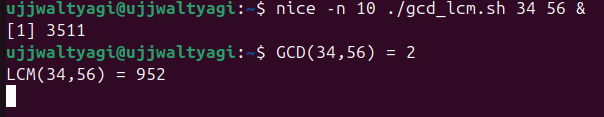
---

### Change priority of running process
```bash
renice +5 -p 12345
renice -n -10 -p 12345
renice -n 5 -p 12345
```
**Explanation:** `renice` changes niceness of PID 12345 (positive increases nice value = lower priority).
---
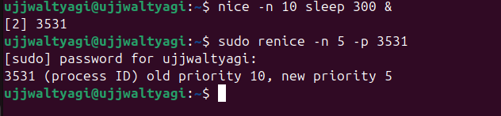
---

### View process open files and resources
```bash
lsof -p 12345
```
**Explanation:** Lists files, sockets, and resources opened by PID 12345.
---
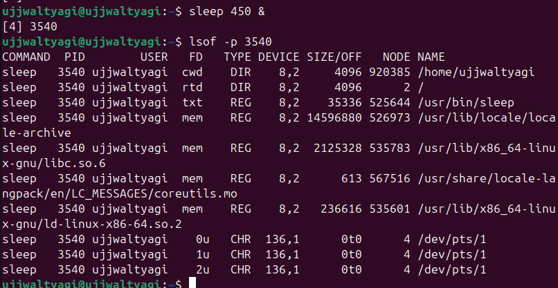
---

### Show process tree for a PID
```bash
ps f -p 12345
```
**Explanation:** Shows process hierarchy for PID 1 (or change PID as needed).

---
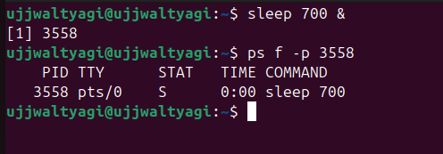
---


## 🧠 Advanced Topics & Tools

This section adds detailed theory, commands and short examples for advanced process-management topics that supplement the previous sections.

---

### Signals (SIGTERM vs SIGKILL and common signals)
- SIGTERM (15) — polite request to terminate; process can catch and clean up.  
- SIGKILL (9) — immediate forced termination; cannot be caught or ignored.  
- SIGHUP (1) — hangup; commonly used to tell daemons to reload config.  
- SIGSTOP / SIGCONT — stop and continue a process (job control).

Example:
```bash
# polite terminate
kill -15 3050

# force kill
kill -9 3050
```
**Explanation:** Prefer SIGTERM then SIGKILL only if process doesn't exit.

---
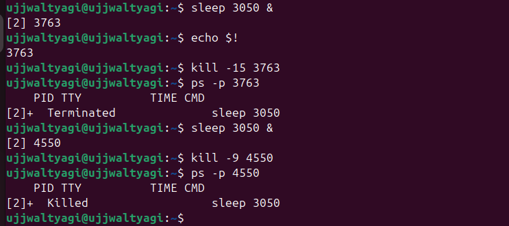
---

### CPU Affinity — taskset (bind process to CPU cores)
- Use CPU affinity to bind a process to specific CPU core(s).
```bash
# view current affinity
taskset -cp 3050

# set affinity to core 1 only
taskset -cp 1 3050

# start a process on cores 0-1
taskset -c 0,1 ./compute-heavy.sh
```
**Explanation:** Useful to reduce cache thrashing or isolate workloads.

---

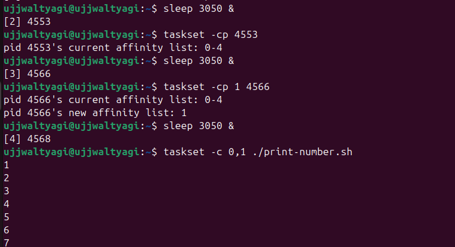
---
### I/O Scheduling Priority — ionice
- Controls disk I/O scheduling class and priority.
```bash
# set process to idle I/O class (only uses disk when idle)
ionice -c 3 -p 3050

# run a command with best-effort class and priority 7
ionice -c 2 -n 7 tar -czf backup.tar.gz /home
```
**Explanation:** Helps limit I/O interference from background jobs.
---
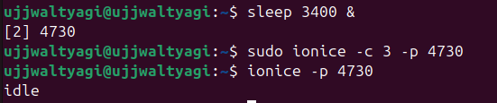
---
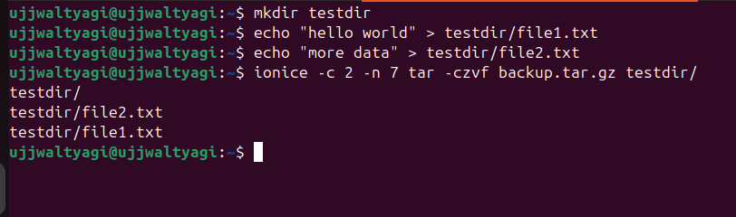
---

### Per-Process Statistics — pidstat
- Monitor per-process CPU usage over time.
```bash
# sample PID 3050 every 2 seconds, 3 samples
pidstat -p 3050 2 3
```
**Explanation:** Useful to observe CPU trends for a specific PID.
---

---

### Trace System Calls — strace
- Attach to a running process and inspect system calls.
```bash
# attach and view syscalls
sudo strace -p 3050

# run a command under strace
strace -o trace.txt ls
```
**Explanation:** Great for debugging why a process is failing (file access, network calls).
---
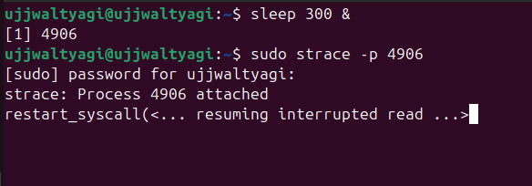
---

---

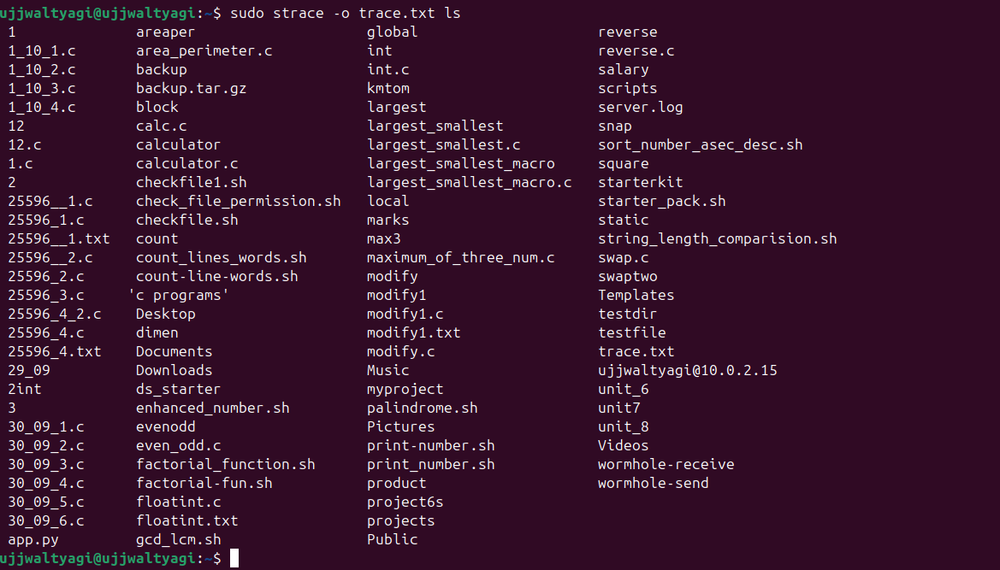
---

### Find Process Using a Port — fuser / ss / netstat
```bash
# find PID using TCP port 8080
sudo fuser -n tcp 8080

# alternative: list sockets and PIDs
sudo ss -tulpn | grep 8080
```
**Explanation:** Identifies which process is bound to a port (useful before killing or reconfiguring).
---
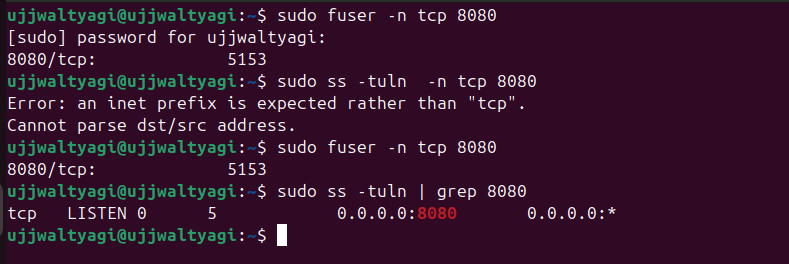
---

### Control Groups (cgroups) — basic resource limiting
- Create a cgroup, set CPU and memory limits, add a PID:
```bash
# create cgroup (requires cgroup-tools or systemd)
sudo cgcreate -g cpu,memory:/testgroup

# limit CPU (cfs quota in microseconds)
echo 50000 | sudo tee /sys/fs/cgroup/cpu/testgroup/cpu.cfs_quota_us

# limit memory to 100MB
echo $((100*1024*1024)) | sudo tee /sys/fs/cgroup/memory/testgroup/memory.limit_in_bytes

# add PID 3050 to the cgroup
echo 3050 | sudo tee /sys/fs/cgroup/cpu/testgroup/cgroup.procs
```
**Explanation:** cgroups provide strong isolation and resource controls for processes or groups.

---
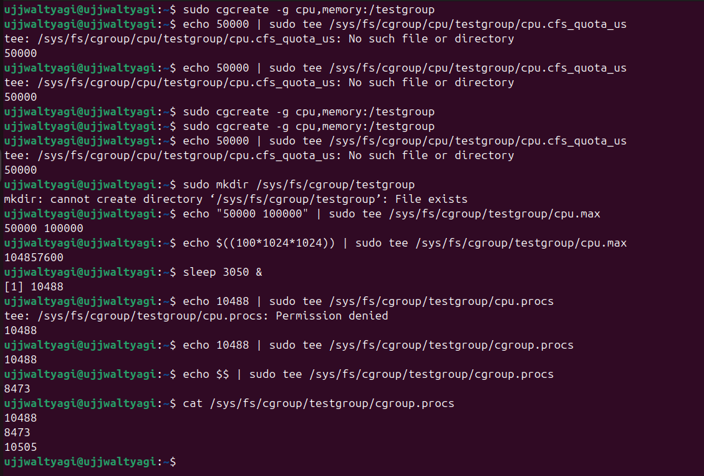
---

### Real-Time Scheduling — chrt
- Set real-time scheduling policies (FIFO or RR).
```bash
# run command with FIFO policy, priority 50
sudo chrt -f 50 sleep 1000

# change scheduling of running PID
sudo chrt -p 50 3050
```
**Explanation:** Use with caution — real-time tasks can starve normal processes.

---
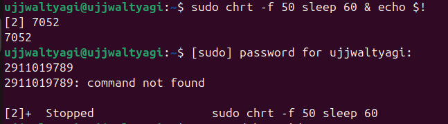
---

---
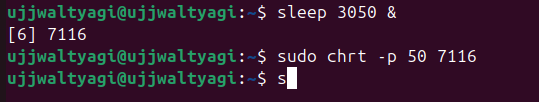
---

### schedtool (advanced scheduling tweaks)
```bash
# set round-robin priority 10 on PID
sudo schedtool -R -p 10 3050
```
**Explanation:** Alternative low-level scheduling tweaks; platform-dependent.

---
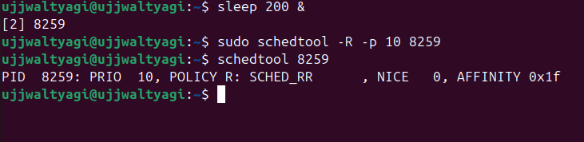
---

### systemd-run — temporary scopes with resource settings
```bash
# run stress under systemd scope with CPUWeight control
systemd-run --scope -p CPUWeight=200 stress --cpu 4

# run a command and limit memory
systemd-run --scope -p MemoryMax=200M ./compute-heavy.sh
```
**Explanation:** Convenient to run one-off tasks with cgroup-based limits via systemd.

---
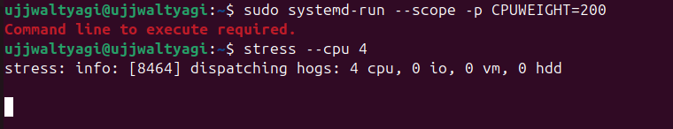
---

---
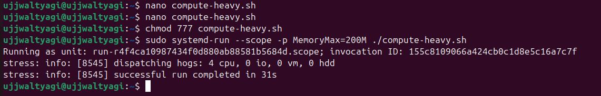
---

### lsof — list open files/resources per process
```bash
lsof -p 3050 | head -10
```
**Explanation:** Shows files, sockets and devices a process has open; helpful for debugging leaks.
---
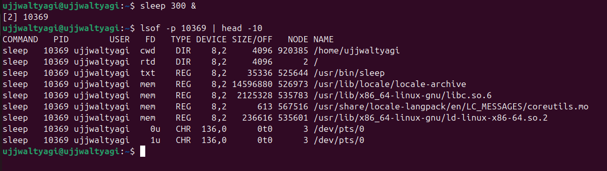
---

### Summary: Tools & When to Use Them

| Tool | Purpose | Use When… |
|------|---------|-----------|
| ps, top, htop | Inspect processes | Quick snapshot or live monitoring |
| pstree, ps f | Parent/child view | Understanding process hierarchy |
| kill, pkill | Send signals | Terminate or signal processes |
| nice, renice | CPU niceness | Lower priority background jobs |
| taskset | CPU affinity | Bind to specific cores |
| ionice | I/O priority | Reduce disk contention |
| pidstat | Per-process stats | Time-series CPU analysis |
| strace | Syscall tracing | Debugging failing processes |
| fuser, ss | Port/process mapping | Identify service owners of ports |
| cgroups, systemd-run | Resource limits | Enforce QoS and isolation |
| chrt, schedtool | Real-time scheduling | Real-time workloads (careful) |

---

## ✅ Practical examples (quick recap)

```bash
# Start low-priority background job
nice -n 10 sleep 300 &

# Bind a running PID to CPU 1
taskset -cp 1 3050

# Make process IO idle
ionice -c 3 -p 3050

# Trace syscalls
sudo strace -p 3050

# Limit memory with systemd-run
systemd-run --scope -p MemoryMax=150M sleep 600
```

---

## 🎓 Conclusion
This practical lab demonstrated essential Linux process management concepts through hands-on examples.

---

## 📚 References & Resources
- 📖 man pages: ps, top, kill, nice, renice
- 🌐 Linux kernel documentation
- 📑 System administration guides

---

<div align="center">

*~ End of Lab Report ~*

</div>
