# Linux Process Management — Lab Report

---

## Title and Introduction

Linux process management covers the mechanisms the kernel and userland provide to create, monitor, control, and terminate processes. Proper process management is essential for resource allocation, stability, performance tuning, and running services reliably on multi-user systems.

---

## Objective

- Demonstrate common process-management concepts and commands in Linux.  
- Run examples to observe process states, control foreground/background tasks, and manage priorities.

---

## Theory

### What is a process?
A process is an instance of a running program with its own memory, execution context, and system resources.

### Process states
- R (Running or Runnable)  
- S (Sleeping — waiting for an event)  
- D (Uninterruptible sleep)  
- T (Stopped by job control or tracer)  
- Z (Zombie — terminated but not reaped)

### Foreground vs Background processes
- Foreground: connected to the terminal; receives input and signals (e.g., Ctrl+C).  
- Background: runs detached from terminal input; started with `&` or moved with `bg`.

### Process IDs (PID)
- PID: unique identifier for a running process.  
- PPID: Parent PID — processes are arranged in a tree (parent → child).

### Parent and Child processes
- Created via `fork()` / `exec()` system calls. Parent waits for children or can reap them later.

### Zombie and Orphan processes
- Zombie: child finished but parent hasn't read its exit status (`wait()` not called). Shown with state `Z`.  
- Orphan: parent exited before child — init (PID 1) adopts the orphan and reaps it.

### Common tools
- `ps` — snapshot of processes.  
- `top` — dynamic, real-time view.  
- `kill` — send signals to processes (SIGTERM, SIGKILL).  
- `nice` — launch process with a given priority (niceness).  
- `renice` — change priority of an existing process.

---

## Commands and Execution

### View all processes (detailed)
```bash
ps aux
```
**Explanation:** Shows all running processes with user, PID, %CPU, %MEM, VSZ, RSS, TTY, STAT, START, TIME, and COMMAND.
---
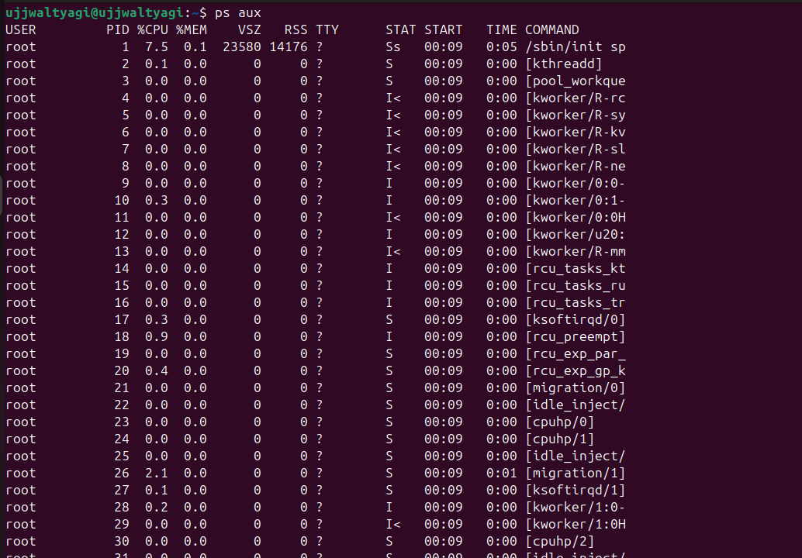
---
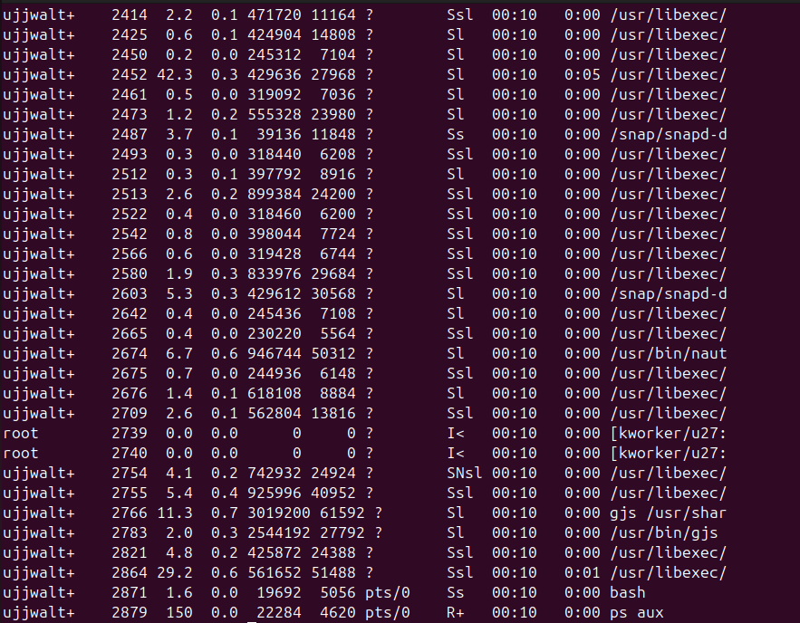
---
### Hierarchical process view
```bash
pstree -p
```
**Explanation:** Displays processes in a tree form with PIDs — useful to see parent/child relations.
---

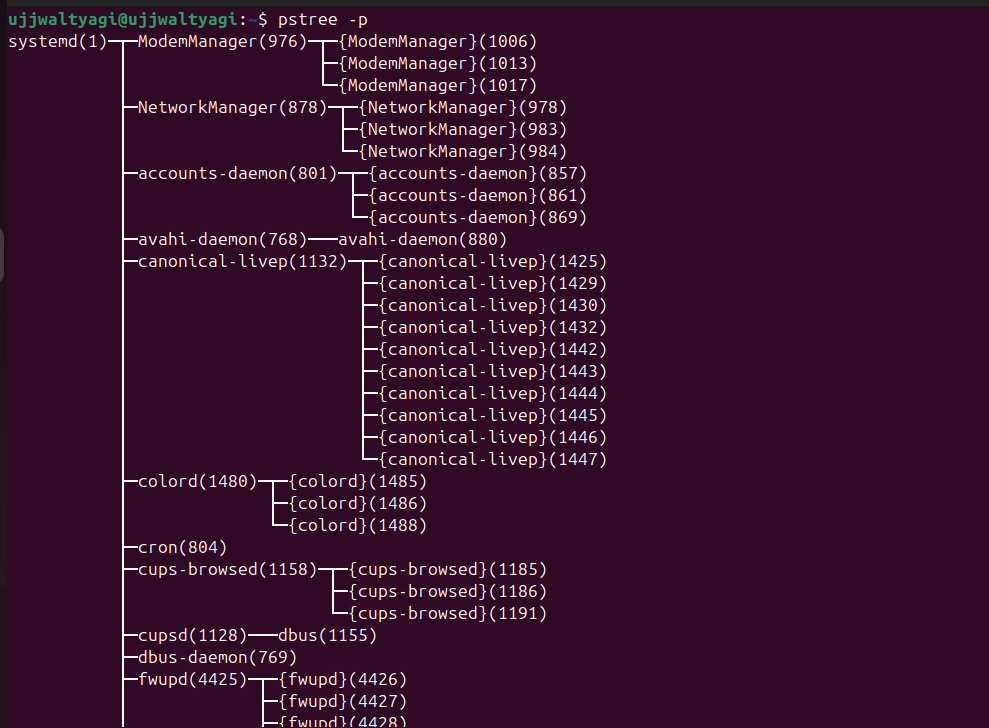

---
---
---

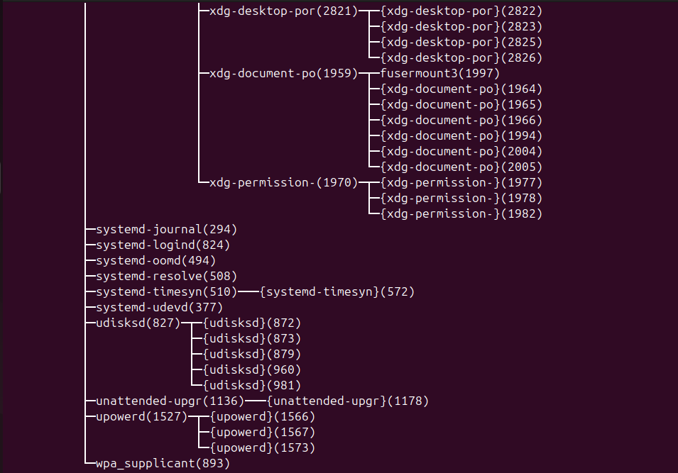

---

### Real-time monitoring
```bash
top
```
**Explanation:** Interactive display of processes sorted by CPU usage. Press `q` to quit.

---

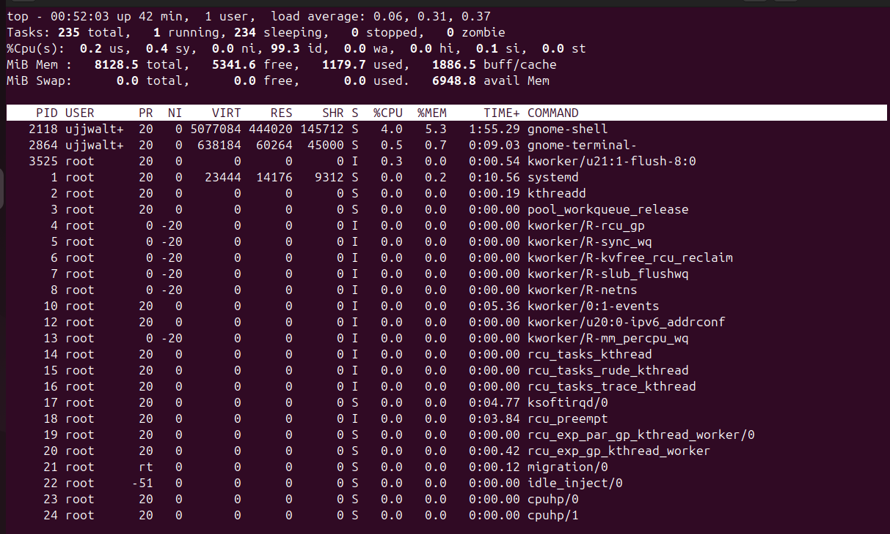


---
```bash
htop
```
**Explanation:** Enhanced interactive viewer with process tree, colors, and easier navigation.

---

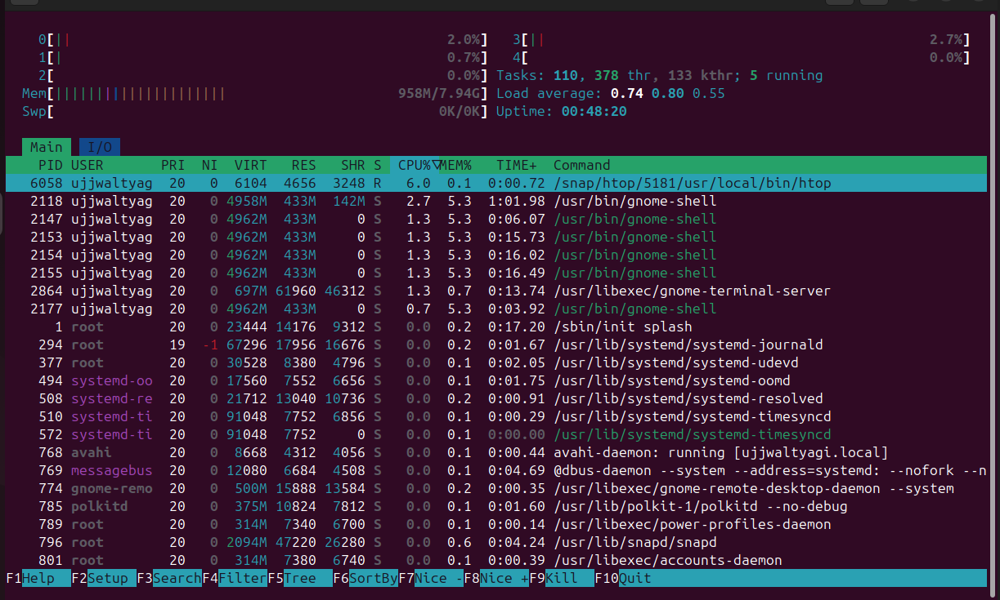

---

### Run process in background
```bash
sleep 300 &
```
**Explanation:** Starts `sleep` in background; shell prints the job number and PID.

---

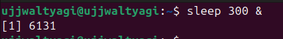

---

### List jobs in current shell
```bash
jobs -l
```
**Explanation:** Lists jobs started from the current shell with job IDs and PIDs.

---
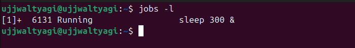
---

### Bring job to foreground / send to background
```bash
fg %1
bg %1
```
**Explanation:** `fg` brings job 1 to foreground; `bg` resumes job 1 in background.

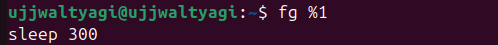
---

### Disown a background job
```bash
disown %1
```
**Explanation:** Removes job 1 from shell's job table so it will not receive SIGHUP on shell exit.

```

```

---

### Run detached (nohup)
```bash
nohup python3 server.py > server.log 2>&1 &
```
**Explanation:** Starts `server.py` immune to hangups; output redirected to `server.log`.

---
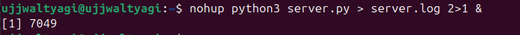
---

### Find process by name / PID
```bash
pgrep -a sshd
pidof bash
```
**Explanation:** `pgrep -a` lists PIDs and command lines matching `sshd`. `pidof` returns PID(s) for a program.
---

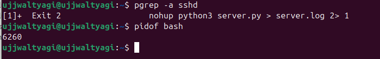
---

### Kill a process (graceful then force)
```bash
kill PID            # sends SIGTERM by default
kill -9 PID         # sends SIGKILL (force)
pkill -f processname
```
**Explanation:** `kill` sends signals to PIDs; `pkill -f` matches the full command line.

--- 
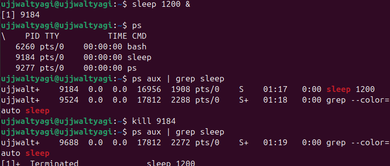
--- 

---
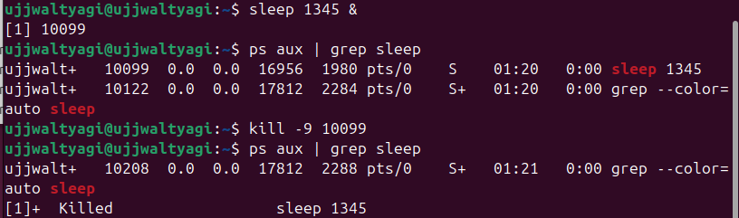
---

---
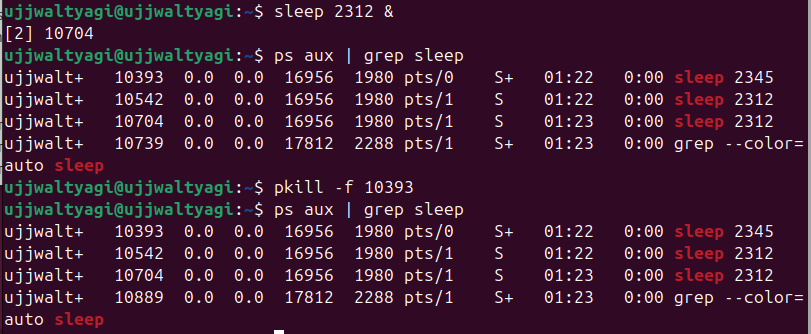
---
### Adjust process priority at start
```bash
nice -n 10 ./compute-heavy.sh
```
**Explanation:** Launches `compute-heavy.sh` with niceness 10 (lower priority).

```

```

---

### Change priority of running process
```bash
renice +5 -p 12345
renice -n -10 -p 12345
```
**Explanation:** `renice` changes niceness of PID 12345 (positive increases nice value = lower priority).

```

```

---

### View process open files and resources
```bash
lsof -p 12345
```
**Explanation:** Lists files, sockets, and resources opened by PID 12345.

```

```

---

### Show process tree for a PID
```bash
ps f -p 1
```
**Explanation:** Shows process hierarchy for PID 1 (or change PID as needed).

```

```

---


---

## Conclusion

This lab covered core Linux process-management concepts: identifying processes, viewing parent/child relationships, controlling jobs in foreground and background, detaching and reattaching processes, terminating processes, and tuning execution priority with `nice` and `renice`. These skills help maintain system stability, troubleshoot performance issues, and run long-lived services safely.

---

## References & Further Reading

- man pages: `man ps`, `man top`, `man kill`, `man nice`, `man renice`, `man lsof`  
- "Linux Performance" guides and kernel documentation for advanced process scheduling topics.

---

