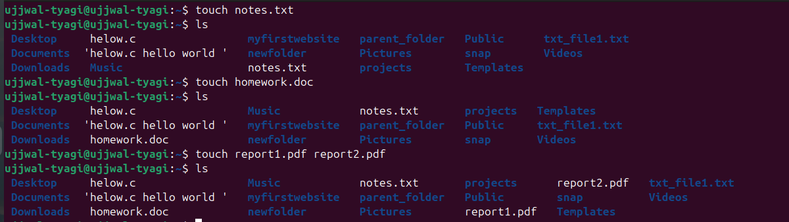
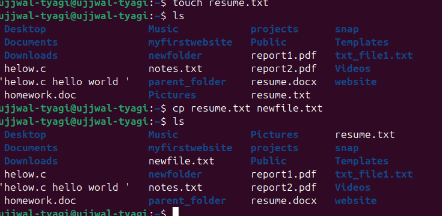
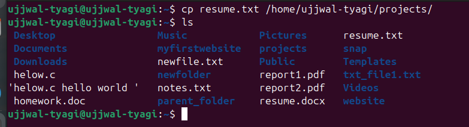
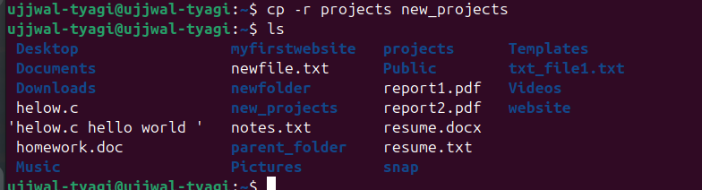
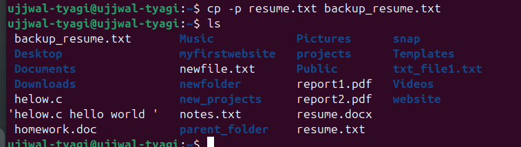
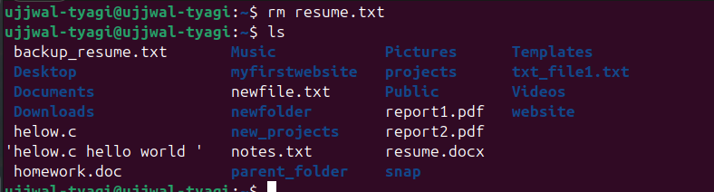
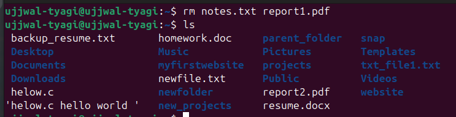

# Advanced File Linux Commands

---

## **1. File Manipulation Commands**

### **`touch`** – Create or Update File Timestamps

```bash
# create an empty file

# update timestamp of an existing file

# create multiple files at once

```

---

### **`cp`** – Copy Files and Directories

```bash
# Copy a file
```

---

```
# Copy to another directory
```

---

```
# Copy directory recursively
```

---
```
# Preserve file attributes (timestamps, permissions)
```

---

### **`mv`** – Move or Rename Files

```bash
# Rename a file
```

---
```
# Move file to another directory
```

---
```
# Move and overwrite without prompt
```

---

### **`rm`** – Remove Files and Directories

```bash
# Remove a file
```

---
```
# Remove multiple files
```

---
```
# Remove a directory recursively
```

---
```
# Force remove without prompt
```

---
```
# Remove a file from inside a folder
```

---

### **`cat`** – View or Concatenate Files

```bash
# Display file contents
```

---
```
# Combine multiple files into one
```

---
```
# Display file with line numbers
```

---

### **`less`** – View File One Page at a Time

```bash
less rellish.txt
# Navigation inside less:
# Space → next page
# b → previous page
# q → quit
```

---

### **`head`** – Show First Lines of a File

```bash
# First 10 lines (default)
```

---
```
# First 20 lines
```

---

### **`tail`** – Show Last Lines of a File

```bash
# Last 10 lines (default)
```

---
```
# Last 15 lines
```

---
```
# Monitor file changes in real-time
```

---

## **2. File Permissions and Ownership**

### **`ls -l`** – View Detailed File Info

```bash
ls -l
# Example output:
# -rw-r--r-- 1 user group 1024 Aug 14 10:00 file.txt
# Breakdown:
# [1] -rw-r--r-- → Permissions
# [2] 1 → Hard link count
# [3] user → Owner
# [4] group → Group owner
# [5] 1024 → File size (bytes)
# [6] Aug 14 10:00 → Last modified date/time
# [7] file.txt → File name
```

---

### **File Permission Structure**

* **Owner (u)** – File creator
* **Group (g)** – Users in same group
* **Others (o)** – Everyone else
  Permissions: **r (read)**, **w (write)**, **x (execute)**

---

### **`chmod`** – Change File Permissions

```bash
# Symbolic method
chmod u+x helow.c  # Add execute for owner
chmod g-w rellish.txt  # Remove write for group
chmod o+r txt_file1.txt  # Add read for others

# Numeric method (r=4, w=2, x=1)
chmod 755 helow.c   # rwxr-xr-x
chmod 644 rellish.txt  # rw-r--r--
```

---

### **`chown`** – Change File Owner

```bash
# Change owner
sudo chown newuser file.txt

# Change owner and group
sudo chown newuser:newgroup file.txt
```

---

### **`chgrp`** – Change Group

```bash
sudo chgrp developers file.txt
```


---

## **3. Advanced File and Directory Operations**

### **`find`** – Search for Files

```bash
# Find by name
```

---
```
# Find by extension
```

---
```
# Find by size (>100MB)
```

---
```
# Find and delete
```

---

### **`grep`** – Search Text in Files

```bash
# Search a pattern
grep "error" logfile.txt

# Case-insensitive search
grep -i "error" logfile.txt

# Recursive search in directory
grep -r "TODO" /project/

# Show line numbers
grep -n "warning" logfile.txt
```

---

### **`tar`** – Archive Files

```bash
# Create archive
tar -cvf archive.tar file1 file2 dir/
```

---
```
# Extract archive
tar -xvf archive.tar

# View archive contents
tar -tvf archive.tar
```

---

### **`gzip` / `gunzip`** – Compress & Decompress

```bash
# Compress
gzip file.txt  # Creates file.txt.gz
```

---
```
# Decompress
gunzip file.txt.gz
```

---

### **`ln`** – Create Links

```bash
# Hard link
ln original.txt hardlink.txt

# Symbolic (soft) link
ln -s /path/to/original symlinkname
```

---