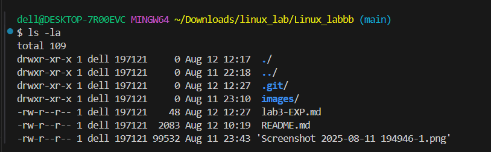

# Basic Linux Commands 
```bash
>> pwd 
```

```
output:
/c/Users/dell/Downloads/linux_lab/Linux_labbb

```
```bash
>>ls
```
```
output for ls:
images/   lab3-EXP.md   README.md  'Screenshot 2025-08-11 194946-1.png'
```
# ls flags

# ls command

```
the ls command in linux allows to view all the files and folders in current working directory. flag -a list down all file and folder including the one which are hidden
```
```bash
>> ls-la
```
## ls-la output

```
total 109
drwxr-xr-x 1 dell 197121     0 Aug 12 12:17  ./
drwxr-xr-x 1 dell 197121     0 Aug 11 22:18  ../
drwxr-xr-x 1 dell 197121     0 Aug 12 12:27  .git/
drwxr-xr-x 1 dell 197121     0 Aug 11 23:10  images/
-rw-r--r-- 1 dell 197121    48 Aug 12 12:27  lab3-EXP.md
-rw-r--r-- 1 dell 197121  2083 Aug 12 10:19  README.md
-rw-r--r-- 1 dell 197121 99532 Aug 11 23:43 'Screenshot 2025-08-11 194946-1.png'
```



